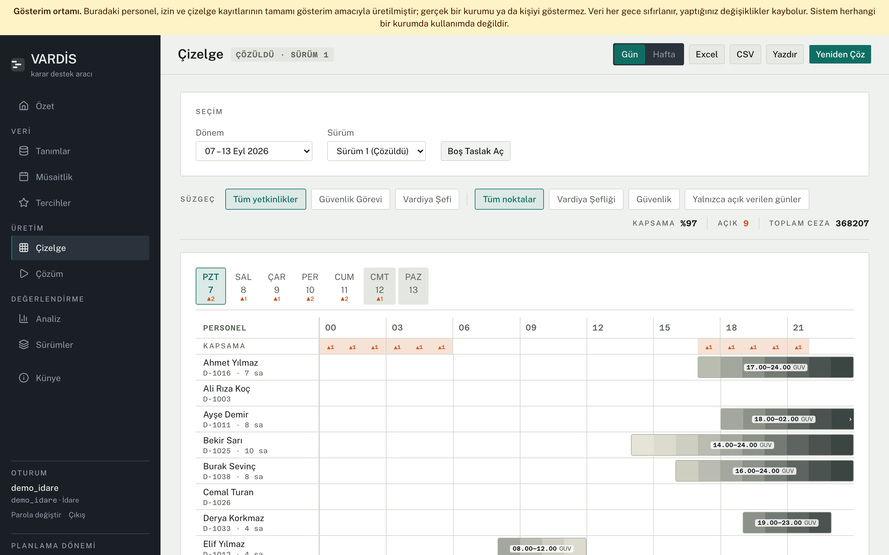
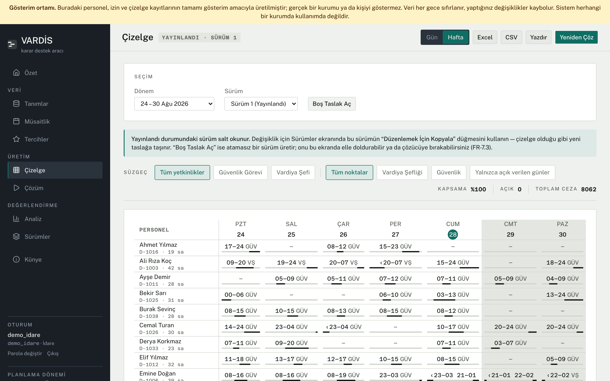
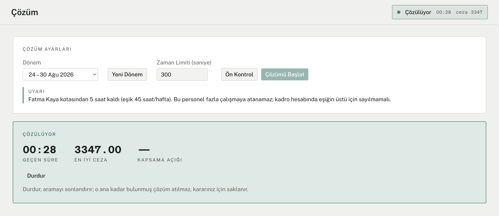
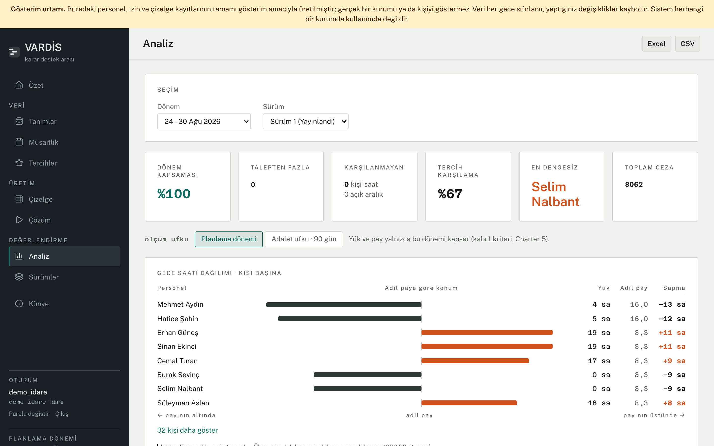
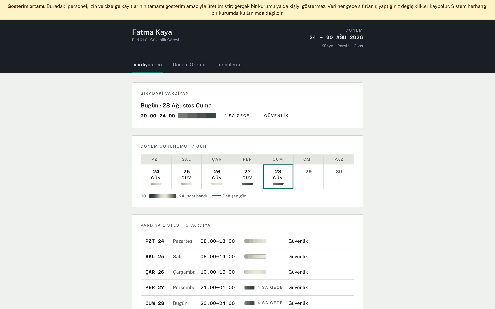

# Shift Scheduling Decision Support Tool

> **Kapsam notu.** Bu proje, TED Üniversitesi CMPE 399 yaz stajı kapsamında
> yürütülmüş kişisel ve akademik bir çalışmadır. BOTAŞ tarafından
> ısmarlanmamış, kurum bünyesinde kullanıma alınmamış ve kurumu hiçbir
> biçimde temsil etmemektedir. Geliştirme sırasında kuruma ait hiçbir gerçek
> veri kullanılmamıştır: depodaki personel, görev noktası, kadro ve talep
> sayılarının tamamı gösterim amacıyla üretilmiş varsayımlardır ve gerçek bir
> çalışma düzenini yansıtmaz.

> **Scope note.** This is a personal academic project carried out during a
> summer internship. It was not commissioned by, deployed at, or endorsed by
> the institution named in the documents, and contains no real institutional
> data. All staffing figures are illustrative assumptions.

A constraint-programming (Google OR-Tools CP-SAT) decision support tool for
building shift schedules: it assigns staff to hourly demand under hard rules
(rest periods, weekly caps, competencies) while balancing night hours,
weekend hours and total load fairly. A web application built on FastAPI +
React + PostgreSQL.

Written as an internship project. The rules, demand patterns and staffing
figures in this repository are illustrative — the tool is generic, and the
data it ships with is generated.

For scope, architecture, and the rule catalogue, see the four canonical
documents under [`docs/`](docs/) (Charter, SRS, Backlog, SDD).

The development plan lives in
[`docs/turlar/UYGULAMA_PLANI_V2.md`](docs/turlar/UYGULAMA_PLANI_V2.md), and
progress is tracked in [`PROGRESS_V2.md`](PROGRESS_V2.md). The phase-one plan
and log were removed from the repository during a documentation cleanup;
they remain in the git history.

## Screenshots

The day grid, where demand and assignments are read hour by hour. This is the
deliberately tight period in the demo data: the coverage strip and the badges
on the day headers mark the hours the roster cannot cover.



The same period as a week strip — forty people at a glance, one row each:



The solve screen. Before starting a search it can be asked what stands in the
way; here the pre-check separates a structural obstacle (the shift-supervisor
pool is 78 person-hours short, and no schedule can close that) from a warning
that only constrains the search (one person is five hours from their annual
overtime quota):



The analysis screen, where a published version is measured — coverage, quota
status, fairness distributions, and the penalty breakdown. Deviation is shown
in both directions against each person's own fair share:



The employee panel, which answers a different question — not "is the schedule
fair" but "when do I work":



Every screenshot is taken from the demo data and carries the strip that says
so.

## Status

Six acceptance criteria are defined in the Project Charter (section 5).
**Five of six pass. K3 does not.**

| Criterion | Threshold | Measured | Result |
|---|---|---|---|
| K1 — time to a usable schedule | < 60 s | 23.14 s | ✅ |
| K2 — hard constraint violations | 0 | 0 | ✅ |
| K3 — night fairness | at most 10% of staff (4 of 40) deviate > 8 night hours | 9 of 40 (22.5%) | ❌ |
| K4 — infeasible instance is explained | ≥ 1 gap, fully described | 88 intervals, 383 person-hours short | ✅ |
| K5 — manual edit validation | < 1 s | 0.229 s (worst of five) | ✅ |
| K6 — re-solve difference reported | report produced, split by type | 998 changes (213 added, 209 removed, 576 altered) | ✅ |

Every row above comes from **one measurement session**: 26 August 2026, on
the reference hardware (4 cores, 3 search workers), at commit `f5c75cd`, with
a **300-second solver time limit** and K3 read under its **current
definition** — a distribution ("at most 10% of staff deviate by more than 8
night hours"), not the earlier "no single person deviates more than 8 hours".
The reference instance is 40 staff over 28 days. Raw output:
`olcum/kabul-20260826-300sn.json`.

**K3 still does not pass under the new definition and the longer limit.** It
is closer than it was — the same instance at 60 seconds put 24 of 40 people
outside their fair share (60%), and 300 seconds brings that to 9 of 40
(22.5%) — but the threshold is 4, and 9 is not 4. The maximum deviation, kept
as a diagnostic rather than a criterion, fell from 62.1 to 24.0 night hours
over the same change.

The reachability diagnostic confirms the target is attainable: all 40 people
can work at a duty point with night demand, and the fair-share band is
33.0–64.1 night hours against an observed spread of 33–68. So the obstacle is
search time, not staffing and not an unreachable target. **Most of the
improvement in night fairness comes from the longer search rather than from
weight calibration** — re-tuning the soft-constraint weights moved the
maximum deviation from 25.0 to 22.0, while the extra search time moved the
count from 24 people to 9. Presenting the improvement as a calibration result
would be misleading.

## Known limitations

- **The solver returns the best schedule found within its time limit**, not a
  proven optimum. A longer limit generally produces a fairer schedule; the
  limit is a parameter (`cozucu_zaman_limiti_saniye`, default 300 s).
- **Cumulative fairness looks back 90 days** (a rolling window over published
  versions). Deviation accumulated before that window is not visible to the
  system, and a deviation accumulated over previous periods cannot be closed
  within a single period.
- **A published schedule is read-only.** Corrections are made by deriving a
  new draft and publishing it; the previous version is archived rather than
  overwritten, so employees can always be shown what changed.
- **Single facility.** Buildings and duty points belong to one facility;
  separate personnel pools per facility are not modelled.
- **Availability has day-level resolution** (full day / morning / afternoon),
  not arbitrary hour ranges.
- **One scheduler at a time.** Concurrent editing of the same version by two
  managers is not handled.

## Measurement environment

The numbers above were measured on the reference hardware, not the
development machine — that is the binding environment, and it is the smaller
of the two.

| | Development machine | Reference hardware |
|---|---|---|
| OS | macOS 15.7.3, arm64 | Linux x86_64 (Ubuntu) |
| Cores | 10 | 4 |
| Memory | 16 GB | 7 GB |
| Search workers | 3 | 3 (cores − 1) |
| PostgreSQL | 17 | 18 |

**The reference host is shared** — other services run on the same machine —
so the measured times should be read as an upper bound rather than a best
case. CP-SAT is also non-deterministic under parallel search: the same
instance can yield different (equally good) solutions across runs, so K3's
count, its maximum deviation and K4's gap count all move between runs. The
K1/K2/K5 values are stable, and so are the pass/fail decisions — K3 fails at
9 against a threshold of 4, far enough from the boundary that run-to-run
variation does not decide it.

## Requirements

See [`VERSIONS.md`](VERSIONS.md) for pinned versions. Summary:

- Python 3.12+
- Node.js 22.x
- PostgreSQL 18 (pinned; see the note below — 16 still works as a floor)

`VERSIONS.md` pins PostgreSQL at 18, which is what the reference host runs.
The development machine is still on 17.x, so the two environments the pin
exists to keep in step are not yet in step — moving development to 18 is the
remaining half of that. Nothing in the schema or the queries depends on a
version above 16; the migrations are the only thing that touches the server
directly and they use no version-specific feature, so 16 remains a working
floor rather than a tested ceiling.

## Setup

```bash
cp .env.example .env   # edit values as needed
./scripts/kurulum.sh
```

The script sets up the backend virtual environment, applies database
migrations, runs the backend tests/lint checks, and installs frontend
dependencies.

## Development

Backend:

```bash
cd backend
source .venv/bin/activate
uvicorn app.main:app --reload
```

`http://localhost:8000/health` should return 200.

Solver worker (**runs in a separate terminal, alongside the API**):

```bash
cd backend
source .venv/bin/activate
python scripts/cozum_iscisi.py
```

The solve job runs in a separate service, not in the API process (SDD 3.4.4);
the two processes only communicate through the database. If this worker
isn't running, solve requests sit `queued` and no schedule is ever produced.
Development thus follows the same path as production.

Creating the first admin account (SRS FR-10.10 — there is **no** in-app
sign-up endpoint; this is how the account-less system bootstraps its first
account):

```bash
cd backend && source .venv/bin/activate
python scripts/yonetim_hesabi_olustur.py
```

The password cannot be passed as an argument; the script prompts for it
without echoing (a password typed on the command line would end up in shell
history and `ps` output). Subsequent accounts are created from the Users
screen in the UI.

**In local development, set `OTURUM_CEREZI_SECURE=false` in `.env`.** The
session cookie carries the `Secure` attribute in production, and the browser
won't send it back over plain `http://localhost`; login fails silently if this
isn't disabled.

Demo data for presentations and for the public demo environment. Its shape is
specified in the demo scenario document, not improvised here: periods are
anchored **to the day they are generated**, and every schedule is produced by
the **real solver** — a hand-written schedule could carry rule violations and
would make the analysis screen lie.

| Period | Status | What it shows |
|---|---|---|
| D-12 … D-1 | published | Twelve past weeks, enough to fill the 90-day fairness horizon. Two of them carry a leave wave, which is what pushes weekly load over the overtime threshold and makes quota consumption visible (H10) |
| D0 (this week) | published | The current schedule. Powers "My Shifts" and "next shift" on the employee panel and the summary screen |
| D+1 (next week) | two versions | Version 1 is solver output; version 2 is a draft derived from it with a few assignments moved by hand, so the versions and comparison screens have a readable difference |
| D+2 | tight draft | A quarter of the staff on leave. The gap is built through **availability**, not headcount: seven of the nine shift supervisors are away and no one else may fill that post (H8), so no block length can close it |

Also included: 40 staff (nine supervisors, thirty-one guards, three
part-time), one person who started halfway through the fairness horizon and
one who left last month, the official holidays that fall inside the demo
window, all four availability types, half-day slots (TD-4), and preferences
in all three states.

**Staffing matches the acceptance measurement's reference sample** so the demo
and the measurement record describe the same scale.

```bash
cd backend && source .venv/bin/activate
python scripts/demo_veri_uret.py                    # first run
VERI_TEMIZLIGINE_IZIN=1 DEMO_PAROLA=... \
  python scripts/demo_veri_uret.py --reset          # wipe and regenerate
VERI_TEMIZLIGINE_IZIN=1 python scripts/demo_veri_uret.py --reset --cozme
```

`--reset` is behind the destructive-operation lock. `DEMO_PAROLA` is the
password for the demo accounts; without it no accounts are created and the
script says so. The password is never written to the repository.

Solving fifteen periods takes roughly twenty minutes; skip it with `--cozme`
if you only need the definition screens.

The generator is deterministic apart from the assignments: two runs on the
same day produce identical definition and input data. CP-SAT searches in
parallel, so the schedules themselves may differ between runs. Verify with:

```bash
cd backend && .venv/bin/python scripts/demo_kabul_olcutleri.py
```

It measures the demo scenario's acceptance criteria and prints a hash of the
definition and input data; two runs with the same hash satisfy the
determinism criterion.

The criterion that checks for leaked names reads its search terms from
`.yasakli-metinler` at the repository root, one per line. That file is not
tracked: a redaction guard that carries the names it looks for defeats
itself once the repository is public. Without the file the criterion reports
that it could not be measured rather than passing — an always-passing check
is worse than no check, because it looks measured.

## Login

There is no sign-up screen (FR-10.1); the first account is created out of
band via a script (FR-10.10). The default username is **`admin`**, with the
admin role — the only role that can manage user accounts:

```bash
cd backend && source .venv/bin/activate
python scripts/yonetim_hesabi_olustur.py
```

The password can't be passed as an argument; the script prompts for it twice
without echoing (minimum 12 characters). Subsequent accounts are created from
the Users screen in the UI.

The test suite never touches this account: tests run against a separate
database (see "Tests and Lint").

### Demo accounts

When `DEMO_KIPI` is on, the login screen lists the demo accounts underneath
the form and fills the fields on click, so there is nothing to memorise. The
same accounts, for reference:

| Username | Role | What it is for |
|---|---|---|
| `demo_idare` | scheduling | Builds and publishes schedules — everything except account management |
| `demo_hesap` | account management | Manages users only; cannot touch a schedule |
| `demo_d1010` | employee | Someone close to their annual overtime quota |
| `demo_d1020` | employee | Someone with an average load |

They share one password, taken from `DEMO_PAROLA` at run time — it is not in
this repository and not in the built bundle. A fifth account with the system
administrator role is created but deliberately **not** listed on the screen:
a public demo that hands every visitor the widest role has handed away
account management too.

With `DEMO_KIPI` off the endpoint behind that box does not exist — it answers
404, not 403, because in a real installation there is no demo credential to
be denied access to.

Frontend:

```bash
cd frontend
npm run dev
```

## Tests and Lint

**Tests run against a SEPARATE database** (Product Backlog B-20). The suite
refuses to run if it doesn't see a test database in the connection string —
it fails loudly instead of silently wiping development data.

One-time initial setup:

```bash
createdb vardiya_test
cd backend
VERITABANI_URL=postgresql+psycopg://vardiya:<PASSWORD>@localhost:5432/vardiya_test \
  .venv/bin/alembic upgrade head
```

Set the address in `backend/.env` (see the line in `.env.example`):

```
TEST_VERITABANI_URL=postgresql+psycopg://vardiya:<PASSWORD>@localhost:5432/vardiya_test
```

The database name must contain `test`; the guard looks for it. The schema is
built through migrations, not `create_all` — the test database follows the
same migration chain as the development database, so the migrations
themselves are implicitly exercised on every run. A new migration must be
applied to both.

```bash
cd backend && source .venv/bin/activate
ruff check . && ruff format --check .
python -m pytest -q
```

```bash
cd frontend
npx tsc --noEmit -p tsconfig.app.json
```

## Deployment

The repository carries no deployment record: a record that names a host names
its address, its login and its key path, and those do not belong in a public
repository. What follows is the whole procedure in placeholders. Substitute
your own values; nothing here is specific to any machine.

Two systemd units are provided in `deploy/`. They run the API and the solver
as **separate processes** — the application server never solves, it leaves
the job queued and the worker picks it up (SDD 3.4.4). Both read their
configuration from an environment file that is **not** in this repository.

```bash
# On the target host, as a user with sudo:
sudo adduser --system --group <SERVICE_USER>
sudo mkdir -p <INSTALL_DIR> && sudo chown <SERVICE_USER>: <INSTALL_DIR>

# Copy the working tree to <INSTALL_DIR>, then:
cd <INSTALL_DIR>/backend
python3 -m venv .venv
.venv/bin/pip install -e ".[dev]"

# Configuration. Start from the example and fill in your own values;
# this file holds the only secret the application needs.
cp <INSTALL_DIR>/.env.example <INSTALL_DIR>/.env
sudo chmod 600 <INSTALL_DIR>/.env
sudo chown <SERVICE_USER>: <INSTALL_DIR>/.env

.venv/bin/alembic upgrade head
```

The unit files hard-code the install directory, the service user and the
port. If yours differ, edit `WorkingDirectory`, `ExecStart` and
`EnvironmentFile` **together** — they are three views of one decision, and
changing one alone leaves a service that starts and then cannot find itself.

```bash
sudo cp deploy/vardiya-api.service deploy/vardiya-cozucu.service /etc/systemd/system/
sudo systemctl daemon-reload
sudo systemctl enable --now vardiya-api.service vardiya-cozucu.service
systemctl is-active vardiya-api vardiya-cozucu
```

The API listens on the loopback interface only. Put a reverse proxy in front
of it that terminates TLS, serves the built frontend as static files, and
forwards `/api/*` to the API port. Serving both from the same origin is what
lets the session cookie work without CORS.

```bash
cd frontend && npm ci && npm run build   # output: frontend/dist
```

`OTURUM_CEREZI_SECURE` must stay `true` wherever the site is served over
HTTPS. The browser will not return a `Secure` cookie over plain HTTP, and the
symptom is a login that fails silently rather than with an error.

### Demo environment

If the deployment is a public demo, three things go into `<INSTALL_DIR>/.env`
(mode 600) — the same file the API already reads:

```
DEMO_KIPI=true
DEMO_PAROLA=<the password shown on the login screen>
```

Both must be in `.env`, not in a second file: `vardiya-api.service` reads
only `.env`, and the API is what serves the strip (`DEMO_KIPI`) and the
credentials box (`DEMO_PAROLA`). Put them elsewhere and both stay off
silently — nothing errors, the screens simply come up without them.

The demo password is not a secret; it is printed on the login screen for
anyone to use. It is kept out of the repository so it does not enter the
version history, which is why it lives in `.env` rather than in code.

The redaction guard reads its search terms from
`<INSTALL_DIR>/.yasakli-metinler` (see "Tests and Lint" below). Without that
file the nightly report says criterion 9.6 could not be measured instead of
passing it, so put it on the host too.

```bash
sudo cp deploy/vardis-demo-sifirlama.service deploy/vardis-demo-sifirlama.timer \
  /etc/systemd/system/
sudo systemctl daemon-reload
sudo systemctl enable --now vardis-demo-sifirlama.timer
systemctl list-timers vardis-demo-sifirlama.timer
```

The destructive-operation lock is opened inside the timer's unit and nowhere
else — put `VERI_TEMIZLIGINE_IZIN` in `.env` and every script on the host,
and the API itself, would inherit the right to wipe the database.

## Project Structure

```
backend/    FastAPI application, SQLAlchemy models, Alembic migrations
frontend/   Vite + React + TypeScript (strict mode)
docs/       Charter, SRS, Backlog, SDD (the canonical four)
docs/turlar/ Plans, tour prompts, handover notes — a record, NOT a source of truth
scripts/    Setup and utility scripts
```

## Progress Tracking

Cross-session context is kept in [`PROGRESS_V2.md`](PROGRESS_V2.md). The
phase-one log is no longer in the tree; it is reachable through the git
history.

## License

**No licence is granted.** This repository is published for code review as
part of an internship project; all rights are reserved by default. You are
welcome to read the code. If you want to use, modify, or redistribute any
part of it, please get in touch first.
