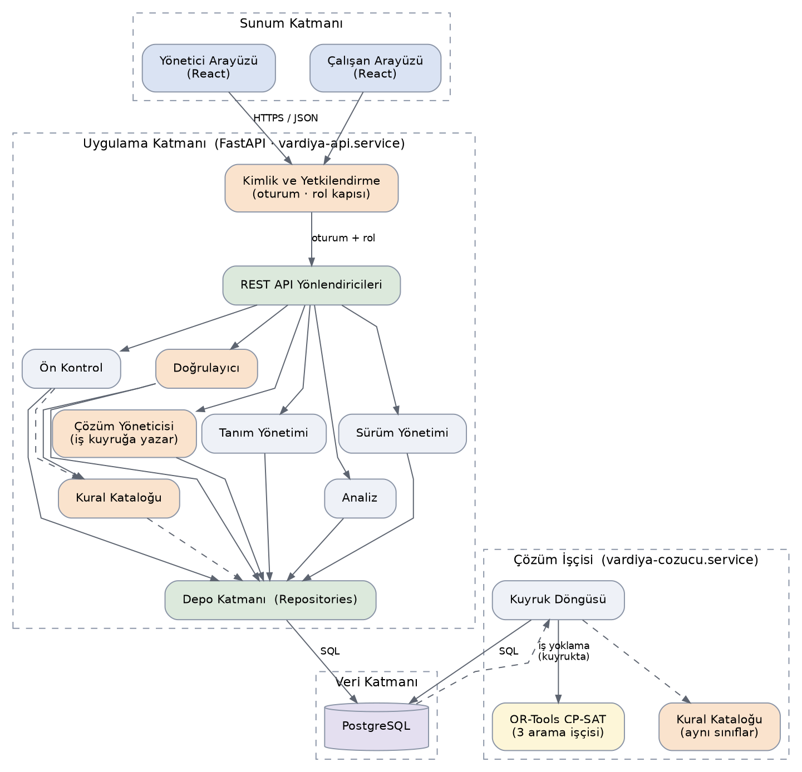
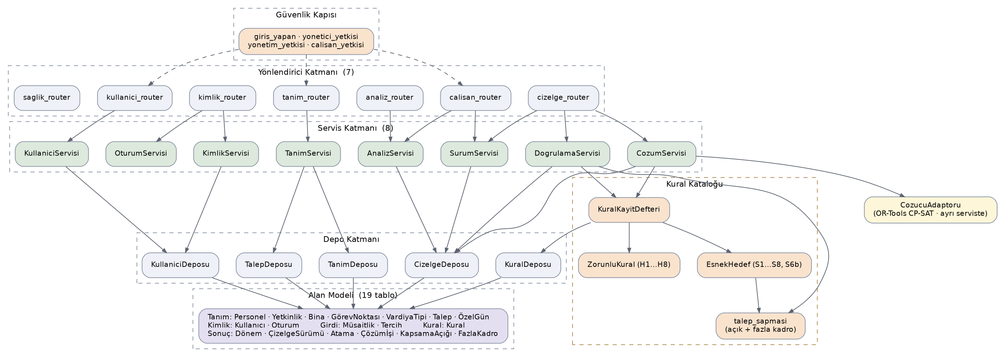
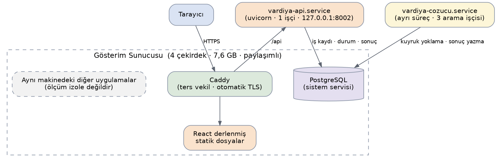
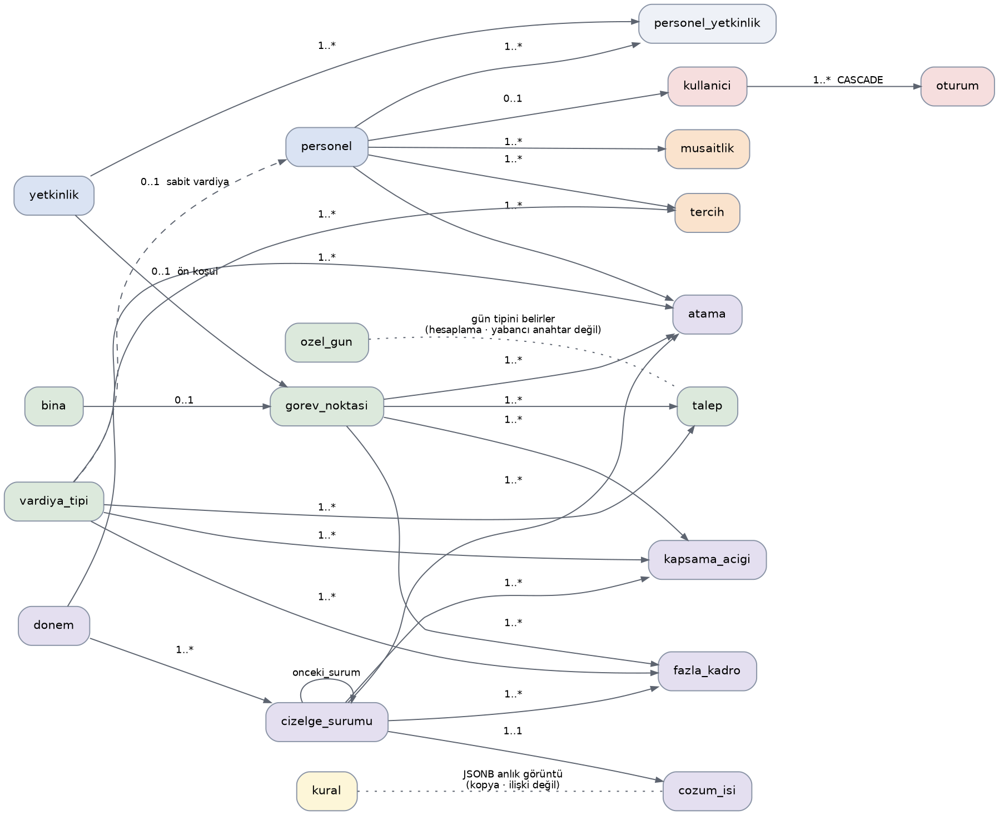
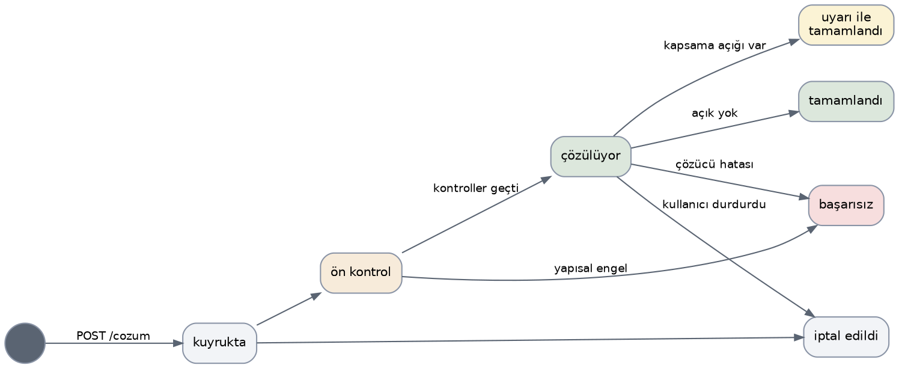

**TED ÜNİVERSİTESİ**

**CMPE 399 — Yaz Stajı**

BOTAŞ Boru Hatları ile Petrol Taşıma A.Ş.

**VARDİYA ÇİZELGELEME KARAR DESTEK ARACI**

**Yazılım Tasarım Dokümanı**

(Software Design Document)

**Ömer HARMANKAYA**

Endüstri Mühendisliği / Bilgisayar Mühendisliği

05.08.2026

Sürüm 1.0

# Revizyon Geçmişi

| Ad | Tarih | Değişiklik Nedeni | Sürüm |
| --- | --- | --- | --- |
| Ömer HARMANKAYA | 05.08.2026 | İlk sürüm — mimari, veri tasarımı, bileşen tasarımı ve arayüz tasarımı tanımlandı | 1.0 |
| Ömer HARMANKAYA | 05.08.2026 | 3.4 Dağıtım Görünümü eklendi; FastAPI/Django gerekçesi genişletildi; Docker'sız kurulum kararı işlendi | 1.1 |
| Ömer HARMANKAYA | 06.08.2026 | Kontrol 2 sözde kodu bireysel izni hesaba katacak şekilde düzeltildi; ön kontrolün zaman-pencereli yetkinlik açıklarını yakalayamama sınırı somut örnekle netleştirildi | 1.2 |
| Ömer HARMANKAYA | 06.08.2026 | 5.5'teki manuel düzenleme doğrulaması düzeltildi: dönem geneli agregasyona dayanan esnek hedefler (S2-S4) artık pencere yerine dönem geneli atama kümesiyle değerlendiriliyor; kural başına kapsam alanı (pencere / dönem geneli) tanımlandı | 1.3 |
| Ömer HARMANKAYA | 07.08.2026 | Ek A'daki S2 örneği düzeltildi: aralık (en yüksek eksi en düşük) minimizasyonu yerine SRS bölüm 4'teki normatif formül (hedeften sapmaların toplamı) kullanılıyor; örnek ile normatif gereksinim arasındaki çelişki giderildi | 1.4 |
| Ömer HARMANKAYA | 07.08.2026 | Ek A'daki S2 dogrula örneği hedefi atanan sayılardan değil talepten türetecek şekilde düzeltildi; kesirli hedeflerin tamsayıya ölçeklenmesi ve raporlamadan önce doğal birime geri çevrilmesi kuralı Ek A'ya eklendi; NFR-1 referans kadrosu üç dokümanda kırk personel olarak hizalandı | 1.5 |
| Ömer HARMANKAYA | 07.08.2026 | Tercih tablosuna calisan_notu ve ret_gerekcesi alanları eklendi; çalışan arayüzü dört bölümden üçe indirildi ve tek sütunlu/mobil öncelikli düzen ile dönem görünümünün takvim sarmalı olarak sunulması yazıldı | 1.6 |
| Ömer HARMANKAYA | 07.08.2026 | 5.7'deki saat dağılımı metriğinin tabanı sözleşme saatinden adil paya (S4'teki pay[p]) çevrildi; gece ve hafta sonu ortalamaları SRS S2/S3'teki uygun havuz üzerinden hesaplanacak biçimde hizalandı | 1.7 |
| Ömer HARMANKAYA | 07.08.2026 | Ek A'daki S2 örneği SRS 1.5 ile hizalandı (payda uygun havuz); havuz hesabının tek bir yerde tutulması ve bütün tüketicilerin oradan alması kuralı eklendi | 1.8 |
| Ömer HARMANKAYA | 08.08.2026 | Gösterim ortamının paylaşımlı bir sunucu olduğu ve ölçümün izole olmadığı 3.4.1 ile 3.4.2'ye işlendi; çözüm işinin iptal mekanizması (veritabanı üzerinden bayrak okuma) ve gecikme sınırı 5.4'e eklendi | 1.9 |
| Ömer HARMANKAYA | 09.08.2026 | Arayüz turunun tasarım etkileri işlendi: yetkinlik, bina ve vardiya tipi tablolarına aktif alanı eklendi ve personel pasifleştirmesinin aktif_bitis'i bir önceki güne yazması tanımlandı (4.2.1); kural sınıflarının katalog üst verisini taşıması ve kural kaydı oluşturma/silmenin mimari olarak mümkün olmaması 3.2.1'e yazıldı; Tanımlar ekranındaki eylem çubuğu ile silme davranışı (6.3.1), Çizelge ekranına eklenen dışa aktarma ve yazdırma (6.3.4) ve arşivden taslak kopyalama (6.3.5) tanımlandı | 1.10 |
| Ömer HARMANKAYA | 09.08.2026 | Ön kontrol bulguları yapısal engel ve yapılandırma uyarısı olarak iki seviyeye ayrıldı; iş yalnızca engelleyici bulgularda düşer. Talep karşılama kuralının pasifleştirilmesi ilk yapılandırma uyarısı olarak tanımlandı (5.2) | 1.11 |
| Ömer HARMANKAYA | 09.08.2026 | Kimlik doğrulama ve yetkilendirme tasarımı eklendi: kullanici ve oturum tabloları (4.2.1), oturum yönetimi, parola saklama ve rol denetimi (5.1b) | 1.12 |
| Ömer HARMANKAYA | 09.08.2026 | Kilit bildirimi ile kullanıcı varlığının gizlenmesi arasındaki gerilimin çözümü ve başarısız giriş sayacının kalıcılığı 5.1b'ye yazıldı | 1.13 |
| Ömer HARMANKAYA | 09.08.2026 | Giriş (6.3.6) ve Kullanıcılar (6.3.7) ekranları tanımlandı; izlenebilirlik matrisine FR-10.x satırı eklendi | 1.14 |
| Ömer HARMANKAYA | 09.08.2026 | Denetim düzeltmeleri: 4.2.4'teki zaman damgası tipleri TIMESTAMPTZ olarak güncellendi, 3.4.5'teki kaldırılmış çalışan paneli anahtarı örneği değiştirildi, 6.3.7'deki var olmayan son giriş alanı çıkarıldı | 1.15 |
| Ömer HARMANKAYA | 11.08.2026 | fazla_kadro tablosu ve ayrı tablo gerekçesi 4.2.4'e eklendi; manuel düzenlemenin sapma tablolarını yenilediği 5.5'e yazıldı; Ek B'nin tam uç nokta listesinin ayrı ve üretilen bir belgede tutulduğu belirtildi | 1.16 |
| Ömer HARMANKAYA | 11.08.2026 | Talep matrisinin gün tipi ekseni üç değerli olarak tanımlandı ve resmî tatil sütunlarının zorunluluğu 6.3.1'e yazıldı | 1.17 |
| Ömer HARMANKAYA | 11.08.2026 | Diyagramlar güncel mimariye göre yeniden üretildi ve veritabanı şeması diyagramı eklendi; 3.1'deki çözücünün süreç içi kütüphane olduğu ifadesi ile 3.2'deki yönlendirici ve servis sayıları düzeltildi | 1.18 |


# 1. Giriş

## 1.1 Amaç

Bu doküman, Vardiya Çizelgeleme Karar Destek Aracı'nın 1.0 sürümü için mimari, veri ve arayüz tasarımını tanımlar. Yazılım Gereksinim Belirtimi'nde (SRS) tanımlanan gereksinimlerin hangi tasarım bileşenlerine dönüştürüldüğünü, bu dönüşümde alınan kararları ve kararların gerekçelerini açıklar.

Doküman, geliştirme sırasında başvurulacak teknik referanstır. Kodun yapısı, veritabanı şeması ve bileşenler arası sözleşmeler burada tanımlandığı biçimde uygulanacaktır. Bu tanımlardan sapılması gerektiğinde, sapma dokümana revizyon olarak işlenir.

## 1.2 Kapsam

Sistem, kesintisiz çalışan bir tesiste vardiya çizelgesini kısıt programlama yoluyla üreten web tabanlı bir karar destek aracıdır. Çizelgeleme problemi Google OR-Tools kütüphanesinin CP-SAT çözücüsüyle modellenmekte; ihlal edilemeyecek kurallar zorunlu kısıt, adalet ve tercihler ise ceza puanı üreten esnek hedef olarak tanımlanmaktadır.

Bu doküman uygulamanın tamamını kapsar: yönetici arayüzü, çalışan arayüzü, uygulama sunucusu, kural kataloğu, çözücü katmanı ve veritabanı. Kapsam dışında bırakılan işlevler Proje Tanım Dokümanı bölüm 4.1'de ve Ürün Backlog'u bölüm 2'de listelenmiştir.

## 1.3 Doküman Yapısı

Bölüm 2 sistemin genel görünümünü ve çalışma ortamını verir. Bölüm 3 mimariyi tanımlar; alt sistemleri, katmanları ve mimari kararların gerekçelerini içerir. Bölüm 4 veritabanı şemasını ve veri sözlüğünü tanımlar. Bölüm 5 her bileşenin yordamsal mantığını sözde kodla açıklar. Bölüm 6 kullanıcı arayüzü tasarımını, ekran envanterini ve ekran nesnelerinin davranışını tanımlar. Bölüm 7 gereksinimlerin tasarım bileşenlerine izlenebilirliğini tablo halinde verir. Bölüm 8 ekleri içerir.

## 1.4 Referanslar

Ref 1. Harmankaya, Ö. (2026). Vardiya Çizelgeleme Karar Destek Aracı — Proje Tanım Dokümanı, Sürüm 1.1.

Ref 2. Harmankaya, Ö. (2026). Vardiya Çizelgeleme Karar Destek Aracı — Yazılım Gereksinim Belirtimi, Sürüm 1.1.

Ref 3. Harmankaya, Ö. (2026). Vardiya Çizelgeleme Karar Destek Aracı — Ürün Backlog'u ve Karar Günlüğü, Sürüm 1.0.

Ref 4. Google. (2026). OR-Tools CP-SAT Solver [Yazılım kütüphanesi]. https://developers.google.com/optimization/cp

Ref 5. T.C. Resmî Gazete. (2003). 4857 sayılı İş Kanunu.

Ref 6. TED Üniversitesi. (2026). CMPE 399 Yaz Stajı — ders materyalleri [Öğrenme yönetim sistemi]. https://lms.tedu.edu.tr/

Ref 7. Anthropic. (2026). Claude [Büyük dil modeli]. Tasarım kararlarının tartışılması ve dokümanın yapılandırılmasında kullanılmıştır. https://claude.ai/

## 1.5 Tanımlar ve Kısaltmalar

| Terim | Açıklama |
| --- | --- |
| CP-SAT | Constraint Programming — Satisfiability. OR-Tools kütüphanesinin kısıt programlama çözücüsü. |
| Çözüm işi | Bir çizelge sürümü için çalıştırılan, asenkron yürüyen ve durumu veritabanında izlenen çözüm görevi. |
| Esnek hedef | İhlal edildiğinde çözümü geçersiz kılmayan, ağırlıklı ceza puanı üreten kural (S1–S8). |
| Görev noktası | Personelin bir vardiya içinde fiilen bulunduğu yer ve üstlendiği rol. Atamanın birimidir (SRS TD-10). |
| Isıtma penceresi | Önceki yayınlanmış çizelgenin son yedi günü. Modele sabit girdi olarak dahil edilir (SRS TD-5). |
| Kural kayıt defteri | Sistemdeki bütün kural sınıflarının kimlikleriyle eşleştirildiği merkezî tablo (bölüm 3.2). |
| ORM | Object-Relational Mapping. Veritabanı tablolarının nesnelerle eşleştirilmesi. |
| PDL | Program Design Language. Bölüm 5'te yordamsal mantığın anlatımında kullanılan yapılandırılmış sözde kod. |
| Ön kontrol | Çözücü çalıştırılmadan önce yürütülen, yapısal engelleri aritmetik olarak tespit eden analiz (bölüm 5.2). |
| Zorunlu kısıt | İhlal edilemeyen, çözümü geçersiz kılan kural (H1–H8). |


# 2. Sistem Genel Bakışı

Sistem, üç katmanlı bir istemci-sunucu uygulamasıdır. Sunum katmanı tarayıcıda çalışan iki tek sayfa uygulamasından, uygulama katmanı Python ile yazılmış tek bir sunucu sürecinden, veri katmanı ise ilişkisel bir veritabanından oluşur.

Uygulama katmanı iki farklı nitelikte iş yürütür ve bu ayrım mimarinin tamamını şekillendirir. Birinci nitelik, tanım yönetimi ve raporlama gibi milisaniyeler mertebesinde tamamlanan istek-yanıt işleridir. İkinci nitelik, dakikalar sürebilen çözüm işidir. Bu iki iş türü aynı süreçte çalışır ancak farklı yaşam döngülerine sahiptir: birincisi HTTP isteğiyle başlayıp yanıtla biter, ikincisi HTTP isteğiyle başlatılır fakat arka planda devam eder ve durumu veritabanı üzerinden izlenir.

Sistem, dış servislere bağımlı değildir; ağ üzerinden erişilen bir bileşen bulunmaz. Çözücü bir kütüphane olarak kullanılır ancak uygulama sürecinin içinde değil, kendi sistem servisinde çalışır (3.4.4); iki süreç yalnızca veritabanı üzerinden haberleşir. Bu ayrım, uzun süren çözüm işinin istekleri bloke etmesini ve çözüm sürecinin sonlanmasının uygulama sunucusunu etkilemesini engeller.

Sistemin kullanıcıları SRS bölüm 2.2'de tanımlanan iki aktördür. Vardiya yöneticisi tanımları girer, çizelgeyi ürettirir, gerektiğinde elle düzeltir ve yayınlar. Çalışan yalnızca yayınlanmış çizelgeyi görüntüler ve tercih bildirir.

# 3. Sistem Mimarisi

## 3.1 Mimari Tasarım

Sistem, sunum, uygulama ve veri katmanlarına ayrılmıştır. Uygulama katmanı içindeki sorumluluklar sekiz alt sisteme ve bunların altında ortak bir kalıcılık katmanına dağıtılmıştır.



*Şekil 3.1 — Üst Düzey Alt Sistem Mimarisi*

#### Alt Sistemler

Tanım Yönetimi Alt Sistemi. Personel, yetkinlik, bina, görev noktası, vardiya tipi, talep matrisi, müsaitlik ve tercih kayıtlarının yaşam döngüsünü yönetir. Çözücüden bağımsız olarak da anlamlı bir yönetim aracı oluşturur ve SRS FR-1.1 – FR-1.14 ile FR-2.x ve FR-3.x gereksinimlerini karşılar.

Kural Kataloğu Alt Sistemi. Sistemin merkezinde yer alır. H1–H8 zorunlu kısıtlarının ve S1–S8 esnek hedeflerinin tanımlarını, parametrelerini ve ağırlıklarını barındırır. Diğer alt sistemlere iki yorumlayıcı sunar: biri kuralı CP-SAT modeline dönüştürür, diğeri verilen bir atamanın kuralı bozup bozmadığını değerlendirir. Her iki yorumlayıcı da aynı kural nesnesinden beslendiği için kural iki ayrı yerde kodlanmaz.

Ön Kontrol Alt Sistemi. Çözücü çalıştırılmadan önce yapısal engelleri aritmetik olarak tespit eder. Kapasite, yetkinlik havuzu ve gün bazlı müsaitlik kontrollerini saniyenin altında yürütür ve tespit ettiği engelleri gün, vardiya ve nokta düzeyinde raporlar. SRS FR-5.x gereksinimlerinin ilk savunma hattıdır.

Çözüm Alt Sistemi. Kural kataloğundan aldığı tanımlarla CP-SAT modelini kurar, çözücüyü çalıştırır, ara çözümleri kaydeder ve sonucu atamalara dönüştürür. Çözüm işinin yaşam döngüsünü yönetir; işi başlatan HTTP isteği yanıtlandıktan sonra da çalışmayı sürdürür.

Doğrulama Alt Sistemi. Yöneticinin çizelge üzerinde yaptığı elle değişikliklerde, değişiklikten etkilenen kuralları kural kataloğunun doğrulayıcı yorumlayıcısıyla yeniden değerlendirir ve bozulan kuralı bildirir. Bütün kuralları baştan değerlendirmek yerine yalnızca etkilenen zaman penceresini incelemesi, SRS NFR'lerindeki bir saniyelik yanıt hedefini karşılamasını sağlar.

Analiz Alt Sistemi. Yayınlanmış veya çözülmüş bir çizelge sürümü üzerinden kapsama oranı, kişi başına gece ve hafta sonu sayısı, saat dağılımı, karşılanan tercih oranı ve ceza dökümü metriklerini hesaplar.

Sürüm Yönetimi Alt Sistemi. Çizelge sürümlerinin durum geçişlerini (taslak, çözüldü, yayınlandı, arşiv) yönetir ve SRS TD-8'de tanımlanan salt okunurluk kuralını uygular. Yayınlanmış bir sürüm üzerinde değişiklik istendiğinde kopyadan yeni taslak üretir.

Çalışan Paneli Alt Sistemi. Çalışana yalnızca yayınlanmış sürümü sunar ve tercih bildirimlerini kabul eder. Yönetici tarafındaki hiçbir yazma işlemine erişimi yoktur.

Depo Katmanı. Yukarıdaki alt sistemlerin altında yer alır ve veritabanına erişimin tek yoludur. SQL bu katmanın dışına çıkmaz. Bu merkezîleştirme, sürüm bütünlüğünün ve atama kayıtlarının tutarlılığının tek bir yerde güvence altına alınmasını sağlar.

#### İşbirliği Deseni

Sistemde iki farklı işbirliği deseni bulunur. Tanım yönetimi, analiz ve doğrulama işlemleri istek güdümlüdür: istemciden gelen HTTPS isteği ilgili yönlendiriciye ulaşır, yönlendirici servisi çağırır, servis depo katmanı üzerinden veritabanına erişir ve yanıt aynı yoldan geri döner.

Çözüm işi ise iş güdümlüdür. İstemcinin çözüm isteği, işi kuyruğa alıp iş kimliğini döndürerek anında yanıtlanır. İş arka planda ön kontrolden geçer, model kurulur, çözücü çalışır ve her ara çözümde ilerleme veritabanına yazılır. İstemci bu ilerlemeyi düzenli aralıklarla sorgulayarak izler. Bu desenin gerekçesi bölüm 3.3'te açıklanmıştır.

## 3.2 Ayrışım Tanımı

Uygulama katmanı, bölüm 3.1'de tanımlanan alt sistemleri dört yatay katman üzerinde gerçekler: yönlendiriciler, servisler, depolar ve alan modeli. Kural kataloğu ve çözücü adaptörü bu katmanların yanında, servis katmanının kullandığı bağımsız bileşenler olarak durur.



*Şekil 3.2 — Uygulama Katmanının Bileşen Ayrışımı*

#### Katman Sorumlulukları

Yönlendirici Katmanı. FastAPI yönlendiricileri ince tutulur. Her uç nokta, isteği şema ile doğrular, tek bir servis metodunu çağırır ve sonucu JSON'a dönüştürür. İş mantığı bu katmanda bulunmaz. Yedi yönlendirici tanımlanmıştır: tanim_router, cizelge_router, analiz_router, calisan_router, kimlik_router, kullanici_router ve saglik_router. Yetkilendirme kapıları yönlendirici düzeyinde bağlanır; böylece bir dosyaya sonradan eklenen uç noktanın kapısız kalması mümkün olmaz (5.1b).

Servis Katmanı. İş mantığını ve işlem sınırlarını barındırır. Sekiz servis tanımlanmıştır: TanimServisi, CozumServisi, DogrulamaServisi, AnalizServisi, SurumServisi, KimlikServisi, OturumServisi ve KullaniciServisi. Bir servis metodunun başlattığı veritabanı işlemi, o metot tamamlandığında ya bütünüyle işlenir ya da bütünüyle geri alınır.

Depo Katmanı. Veritabanına erişimin tek noktasıdır. Her depo tek bir varlık ailesine alan tipiyle erişim sunar; ham SQL bu katmanın dışına sızmaz.

Alan Modeli. Veritabanı tablolarına karşılık gelen veri sınıflarını içerir. Bu sınıflar davranış taşımaz; iş mantığı servis katmanında yer alır. Bu tercih, işlem yönetimini basitleştirir ve nesnelerin çözücüye aktarılmasını kolaylaştırır.

Çözücü Adaptörü. OR-Tools kütüphanesiyle olan bütün etkileşimi kapsar ve sistemin geri kalanına dar bir arayüz sunar: model kur, çöz, ara çözüm bildir, sonucu döndür. Kütüphanenin sürüm değişiklikleri veya çözücünün değiştirilmesi yalnızca bu bileşeni etkiler.

### 3.2.1 Kural Kataloğunun Yapısı

Kural kataloğu, bu tasarımın en belirleyici bileşenidir ve iki parçadan oluşur: kodda tanımlı kural sınıfları ve veritabanında tutulan kural verisi.

Her kural, ortak bir arayüzü uygulayan bir sınıftır. Arayüz iki metot tanımlar. Birincisi kuralı CP-SAT modeline ekler; ikincisi verilen bir atama kümesinde kuralın ihlal edilip edilmediğini değerlendirir ve ihlal varsa açıklamasını döndürür. Zorunlu kısıtlar ile esnek hedefler bu arayüzün iki alt tipidir; esnek hedefler ayrıca modele ceza terimi katkısı üretir.

```
class Kural:
    kimlik: str                # 'H2', 'S4', ...
    tip: KuralTipi             # ZORUNLU | ESNEK
    parametreler: dict
    agirlik: int | None        # yalnız esnek hedeflerde

    def modele_ekle(self, model, degiskenler, baglam) -> CezaTerimi | None:
        ...
    def dogrula(self, atamalar, baglam) -> list[Ihlal]:
        ...
```


Kural sınıfları, uygulama başlatılırken kimliğine göre bir kayıt defterine yazılır. Veritabanındaki kural tablosu her kural için hangi kimliğin aktif olduğunu, parametre değerlerini ve esnek hedefler için ağırlığı tutar. Bir çözüm işi başlatıldığında kayıt defteri, veritabanındaki satırlarla eşleştirilerek o çalıştırmaya özgü kural nesneleri üretilir.

Kural sınıfı, davranışının yanında katalog üst verisini de taşır: SRS bölüm 4'teki kural adı ve açıklaması ile parametre başına etiket, birim ve kabul edilen değer aralığı. Bu bilginin sınıfla birlikte durmasının nedeni, arayüzün kural parametrelerini ham veri olarak değil alan-değer çiftleri hâlinde sunabilmesi ve girilen değerin çözücüye ulaşmadan doğrulanabilmesidir. Üst verinin ayrı bir yerde tutulması hâlinde, kural sınıfı değiştiğinde açıklama ve sınırların sessizce geride kalma riski doğar.

Kayıt defteri aynı zamanda hangi kuralların var olabileceğini belirler: kural tablosundaki her satır kayıt defterindeki bir sınıfla eşleşmek zorundadır, sınıfı bulunmayan bir satır yüklenemez. Bunun doğrudan sonucu, kullanıcının arayüzden yeni bir kural kaydı oluşturamaması ve mevcut kayıtları silememesidir; kullanıcının yetkisi parametre, ağırlık ve aktiflik ile sınırlıdır. Yeni bir kural tipi eklemek bölüm 3.3'te açıklandığı üzere kod değişikliği gerektirir.

Bu tasarımın iki sonucu vardır. Kural değerinin değiştirilmesi — ardışık gece sınırının üçten dörde çıkarılması gibi — yalnızca veri değişikliğidir ve arayüzden yapılır; kod değişmez. Yeni bir kural tipinin eklenmesi ise yeni bir sınıf yazmayı gerektirir. Bu ayrım bilinçlidir ve gerekçesi bölüm 3.3'te açıklanmıştır.

Çözücü ile doğrulayıcının aynı kuralı ifade ettiği, tip sistemi tarafından güvence altına alınamaz; iki metot ayrı ayrı yazılmıştır. Bu nedenle tasarım, uyumu bir doğrulama testine bağlar: rastgele üretilen örnekler çözülür ve elde edilen çizelge doğrulayıcıdan geçirilir. Çözücünün geçerli saydığı bir çizelgede doğrulayıcının ihlal bulması ya da tersi, bir yazılım hatası olarak ele alınır. Bu test, sürekli tümleştirme kapsamında her değişiklikte çalıştırılır.

## 3.3 Tasarım Gerekçesi

#### Python ve OR-Tools

Uygulama sunucusunun dili, çözücü seçiminden türemiştir. Problem kısıt programlama olarak modellendiği için CP-SAT kullanılmakta; CP-SAT'ın birinci sınıf desteklediği diller ise Python, C++, Java ve C# ile sınırlıdır. Bu kısıt, alternatif çalışma zamanlarını değerlendirme dışı bırakmıştır. Python, kalan seçenekler arasında geliştirme hızı ve kütüphane olgunluğu bakımından öne çıkmaktadır.

Web çatısı olarak FastAPI seçilmiştir. Sistemin sunucu tarafı, esas olarak çözücüyü saran ince bir katmandır; tam donanımlı bir çatının getireceği yapı bu ihtiyacın üzerindedir. FastAPI ayrıca şema tabanlı istek doğrulamasını dilin tip açıklamalarından türettiği için, yönlendirici katmanının ince kalması hedefini doğrudan destekler.

Django, özellikle yerleşik yönetim arayüzü nedeniyle alternatif olarak değerlendirilmiştir. Bu arayüz, Bölüm 3.1'de tanımlanan tanım yönetimi ekranlarının büyük bölümünü hazır sunacağından gerçek bir zaman kazancı sağlardı. Ancak tanım ekranları, ürünün sunulan yüzeyinin parçasıdır ve kendine özgü bir görsel dile sahip olması beklenmektedir; Django Admin'in kendi arayüz kalıbı bu beklentiyle uyuşmamakta, üzerine özel bir görünüm inşa etmek ise sıfırdan yazmaktan farklı bir kazanç sunmamaktadır. Django'nun bu projede en güçlü olduğu nokta böylece devre dışı kalmakta, geriye kalan ORM ve göç araçları ise FastAPI tarafında SQLAlchemy ve Alembic ile eşdeğer biçimde karşılanmaktadır. Seçim, bir çatının diğerinden üstün olmasından değil, sistemin CRUD ağırlıklı bir iş uygulaması değil API ile hesaplama servisinin birleşimi olmasından kaynaklanmaktadır.

#### Çözümün Asenkron Yürütülmesi

Kabul kriteri, kırk personel ve yirmi sekiz günlük referans örneğin altmış saniyenin altında çözülmesini öngörmektedir. Bu süre, bir HTTP isteğinin makul yanıt süresinin çok üzerindedir; ayrıca ara sunucular ve tarayıcılar uzun süre açık kalan bağlantıları kesebilir. Çözümün istek-yanıt döngüsü içinde yürütülmesi bu nedenle uygulanabilir değildir.

Çözüm işi bu yüzden arka planda yürütülür ve durumu veritabanında izlenir. Bu tercihin ikinci bir kazancı vardır: CP-SAT ara çözümleri geri çağırma yoluyla bildirebildiği için, kullanıcıya çözüm ilerledikçe güncellenen bir ceza değeri ve kapsama açığı sayısı gösterilebilir. Kullanıcı, çözümün nereye yakınsadığını görerek erken durdurma kararı verebilir.

Kuyruk altyapısı (Celery, Redis vb.) kullanılmamıştır. Sistemde tek bir vardiya yöneticisi varsayıldığı ve eş zamanlı çözüm ihtiyacı bulunmadığı için, uygulama sürecinin kendi arka plan görevi ile işin durumunu tutan bir veritabanı tablosu yeterlidir. Ek altyapı, kazanımı olmayan bir işletim yükü getirecektir. Çok kullanıcılı kullanım gündeme geldiğinde bu karar Ürün Backlog'u T-02 kapsamında yeniden değerlendirilecektir.

#### Kural Kataloğunun Kod ve Veri Olarak Bölünmesi

Kuralların tamamen veri olarak tanımlanması, yani veritabanında saklanan bir kural dilinin çalışma zamanında yorumlanması değerlendirilmiş ve reddedilmiştir. Böyle bir dil, yeni kural tiplerinin kod değişikliği olmadan eklenebilmesini sağlardı; ancak dilin kendisinin tasarlanması, ayrıştırılması ve doğrulanması, projenin kabul kriterlerine katkı sağlamayan bağımsız bir iş kalemidir.

Seçilen yapıda kural tipleri kodda, kural değerleri veritabanındadır. Bu, kuruma özgü değerlerin — dinlenme süresi, ardışık gece sınırı, ağırlıklar — kod değişikliği olmadan ayarlanabilmesi gereksinimini karşılar; bu gereksinim gerçek kullanımda ortaya çıkan ihtiyaçtır. Yeni kural tipi ekleme ihtiyacı ise nadir ve geliştirici müdahalesi gerektiren bir durumdur.

#### İlişkisel Veritabanı

Veri modeli yoğun biçimde ilişkiseldir: personel ile yetkinlik arasında çoktan-çoğa, görev noktası ile bina ve yetkinlik arasında çoktan-bire, atama ile personel, vardiya tipi ve görev noktası arasında üçlü ilişki bulunmaktadır. Bu yapıda ilişkisel model doğal karşılıktır.

PostgreSQL, kural parametrelerinin ve ceza dökümünün yapılandırılmış belge alanında (JSONB) saklanabilmesi nedeniyle tercih edilmiştir. Kural parametreleri kurala göre farklı alanlara sahip olduğundan, her kural tipi için ayrı sütun tanımlamak yerine tek bir belge alanında tutulmaları şemayı sadeleştirmektedir.

#### Tek Süreçli Dağıtım

Sistem mikroservislere ayrılmamıştır. Çözücünün ayrı bir servise taşınması, süreçler arası veri aktarımı ve dağıtım karmaşıklığı getirmekte; buna karşılık tek kullanıcılı ve tek tesisli bir kullanımda ölçekleme kazancı sağlamamaktadır. Uygulama, sunucu tarafında tek bir süreç olarak dağıtılır.

Sunucunun sunucusuz (serverless) bir platformda çalıştırılması ise çözüm süresi nedeniyle uygulanabilir değildir. Sunucusuz platformların yürütme süresi sınırları ve paket boyutu kısıtları, uzun süren çözüm işleriyle ve OR-Tools kütüphanesinin boyutuyla bağdaşmamaktadır. Uygulama sunucusu bu nedenle kalıcı süreç olarak barındırılacaktır. Sunum katmanı statik dosyalardan ibaret olduğu için ayrı bir statik içerik ağı üzerinden dağıtılabilir.

## 3.4 Dağıtım Görünümü

Sistem, geliştirme ve gösterim aşamalarının her ikisinde de konteynerleştirme kullanılmadan doğrudan işletim sistemi üzerine kurulur. Bu bölüm, hem geliştirme sürecindeki hem de gösterim aşamasındaki çalışma ortamını ve bu ortamın tasarım üzerindeki etkilerini tanımlar.

### 3.4.1 Ortamlar

| Ortam | Yapılandırma | Kullanım |
| --- | --- | --- |
| Geliştirme | Geliştirici makinesinde, sistem üzerine doğrudan kurulmuş Python, Node.js ve PostgreSQL ile uvicorn ve Vite geliştirme sunucuları | Sprint 1–3 boyunca gündelik geliştirme |
| Gösterim | Tek sunucuda, sistem üzerine doğrudan kurulmuş aynı yığın; uygulama ve çözüm işçisi systemd servisi olarak, önlerinde Caddy. Sunucu başka uygulamalarla paylaşılmaktadır (aşağıya bakınız) | Mentör sunumu ve kabul denemeleri |
| İleri aşama | Ayrılmış veritabanı hizmeti, bağımsız çözüm işçisi, kurumsal kimlik doğrulama | Kapsam dışı; Ürün Backlog'u B-05 ve T-02 |


Konteynerleştirme bilinçli olarak dışarıda bırakılmıştır. Sistem tek sunucuda, tek kullanıcı için çalışacağından, konteynerin çözdüğü izolasyon ve taşınabilirlik sorunları bu ölçekte karşılığı olmayan bir katman eklemektedir. Doğrudan kurulum, gösterim öncesi hata ayıklamayı ve sunucudaki günlük kayıtlarına erişimi basitleştirir.

Bunun karşılığında geliştirme ve gösterim ortamları arasındaki sürüm eşliği elle sağlanmalıdır. Bu risk iki şekilde karşılanır: Python, Node.js ve PostgreSQL sürümleri bir sürüm dosyasında sabitlenir; kurulum adımları (bağımlılıkların kurulması, veritabanı göçlerinin uygulanması, servislerin tanımlanması) tek bir kurulum betiğine yazılır ve iki ortamda da aynı betik çalıştırılır.

Gösterim sunucusunda uygulama ve çözüm işçisi ayrı systemd servisleri olarak tanımlanır. Bu, konteynerin sağladığı iki pratik faydayı — süreç çöktüğünde otomatik yeniden başlatma ve sunucu yeniden başladığında otomatik ayağa kalkma — konteyner katmanı olmadan verir. Caddy, sistem paketi olarak kurulur ve alan adı sertifikasını otomatik yönetir; gelen istekleri statik dosyalar için doğrudan derlenmiş React çıktısına, API istekleri için uygulama servisine yönlendirir. PostgreSQL de sistem servisi olarak kurulur; veri dizini işletim sisteminin dosya sisteminde durur ve servis güncellemelerinden etkilenmez.

Gösterim sunucusu bu sisteme ayrılmış değildir; üzerinde başka uygulamalar da çalışmaktadır. Bunun iki pratik sonucu vardır. Birincisi, uygulama sunucusunun dinlediği yerel kapı diğer uygulamalarla çakışmayacak biçimde seçilir ve ters vekil zaten kurulu olan Caddy örneği üzerinden yapılandırılır; sisteme ait servisler proje önekiyle adlandırılır. İkincisi ve tasarım açısından önemlisi, çekirdek paylaşımı yalnızca 3.4.3'te tanımlanan uygulama–çözücü paylaşımından ibaret değildir: aynı makinedeki diğer uygulamalar da işlemciyi kullanır. Kurulum ayrıntıları, sunucuya özgü oldukları ve bu dokümanın tasarım kapsamına girmedikleri için ayrı bir dağıtım kaydında tutulur.



*Şekil 3.3 — Gösterim Ortamı Dağıtım Görünümü*

### 3.4.2 Referans Donanım ve Çözüm Süresi

Gösterim ortamının referans donanımı dört çekirdekli işlemci ve sekiz gigabayt bellektir. Bu tanım, kabul kriterlerinin ölçüldüğü zemini oluşturur ve dokümanda yer alması zorunludur: CP-SAT paralel arama yürüttüğü için çözüm süresi çekirdek sayısına doğrudan bağlıdır ve donanım belirtilmeden verilen bir süre ölçümü tekrarlanabilir değildir. Kabul kriterinde tanımlanan kırk personel ve yirmi sekiz günlük referans örneğin altmış saniyelik hedefi, bu donanım üzerinde ölçülecektir.

Referans donanım tanımı, ölçümün üzerinde yapıldığı makinenin bu sisteme ayrılmış olduğu anlamına gelmez. Gösterim sunucusu paylaşımlı olduğundan, ölçüm sırasında aynı makinedeki diğer uygulamaların işlemci kullanımı süreleri etkileyebilir. Bu nedenle kabul ölçümü, diğer uygulamaların boşta olduğu bir anda alınır ve ölçüm kaydında ortamın paylaşımlı olduğu açıkça belirtilir. Ölçülen süre, izole bir makinede alınacak sürenin üst sınırı gibi okunur.

Bellek, sistemin kısıtlayıcı kaynağı değildir. Referans örnekte üretilen karar değişkeni sayısı yirmi bin mertebesindedir; bu ölçek CP-SAT için küçüktür ve sekiz gigabayt fazlasıyla yeterlidir. Kısıtlayıcı kaynak işlemci çekirdeğidir.

### 3.4.3 Çekirdek Paylaşımı

Çözüm işi bütün çekirdekleri doyurursa uygulama programlama arayüzü yanıt veremez hâle gelir. Bu, tasarımın amacını doğrudan çürütür: çözüm ilerlemesinin izlenebilmesi için arayüzün çözüm sırasında yanıt verebiliyor olması gerekir. Bu nedenle çözücüye verilen arama işçisi sayısı, mevcut çekirdek sayısının bir eksiği olarak yapılandırılır. Dört çekirdekli referans donanımda bu sayı üçtür; kalan çekirdek uygulama sunucusu ve veritabanı için ayrılır.

Arama işçisi sayısı yapılandırma değişkeni olarak tutulur ve donanım değiştiğinde kod değişikliği gerektirmeden güncellenir.

### 3.4.4 Çözüm İşinin Yürütme Bağlamı

Çözüm işi, uygulama sunucusunun istek işleyen olay döngüsünde çalıştırılmaz. Çözücü, işlemciyi kesintisiz kullanan ve dakikalar sürebilen bir hesaplama yürütür; bu hesaplamanın olay döngüsünde yer alması, işin sürdüğü boyunca bütün isteklerin bekletilmesine yol açar. Sonuç olarak çözüm durumunu sorgulayan istekler de yanıtsız kalır ve asenkron tasarımın sağladığı kazanç ortadan kalkar.

Bu nedenle çözüm işi ayrı bir yürütme bağlamında — ayrı bir sistem servisi olarak, ayrı bir süreçte — çalıştırılır. Süreçler arasında doğrudan iletişim kurulmaz; iş durumu, ilerleme bilgisi ve sonuç yalnızca veritabanı üzerinden aktarılır. Bu tercih iki kazanç sağlar. Birincisi, çözüm sürecinin beklenmedik biçimde sonlanması uygulama sunucusunu etkilemez; iş kaydı veritabanında kaldığı için durum tespit edilebilir ve systemd süreci otomatik olarak yeniden başlatır. İkincisi, ileride çözüm işçisinin ayrı bir makineye taşınması, aradaki sözleşme zaten veritabanı olduğu için mimari değişiklik gerektirmez.

### 3.4.5 Yapılandırma ve Veri Saklama

Veritabanı erişim bilgileri, çözücü zaman limiti, arama işçisi sayısı, oturum süreleri ve parola politikası eşikleri gibi ortama bağlı değerler ortam değişkenleri olarak sağlanır; kaynak kodda yer almaz. Aynı kod tabanı hem geliştirme hem gösterim ortamında yalnızca ortam değişkenleri değiştirilerek çalıştırılır.

Gösterim ortamında veritabanının düzenli yedeği alınır. Sistem tek kullanıcılı olduğundan ve veri hacmi küçük kaldığından, günlük tam yedek yeterlidir; noktasal geri dönüş mekanizmasına ihtiyaç duyulmamaktadır.

# 4. Veri Tasarımı

## 4.1 Veri Tanımı

Veritabanı dört varlık kümesine ayrılır. Tanım varlıkları (personel, yetkinlik, bina, görev noktası, vardiya tipi, talep, özel gün) sistemin yapılandırmasını taşır ve çizelgeden bağımsız olarak yaşar. Girdi varlıkları (müsaitlik, tercih) belirli bir döneme ilişkin değişken bilgiyi tutar. Kural varlığı, kural kataloğunun veri parçasıdır. Sonuç varlıkları (dönem, çizelge sürümü, atama, çözüm işi, kapsama açığı) çözücünün ürettiği çıktıyı ve çalıştırma kaydını saklar.

Bu ayrımın tasarımsal karşılığı şudur: tanım varlıkları güncellendiğinde daha önce üretilmiş çizelgeler geçersiz hâle gelmez. Yayınlanmış bir çizelge sürümü, üretildiği andaki atamaları kendi içinde taşır ve tanımların sonradan değişmesi bu kayıtları etkilemez. Bir çizelgenin hangi kural değerleriyle üretildiğinin izlenebilmesi için, çözüm işi kaydı o çalıştırmada kullanılan kural parametrelerinin anlık görüntüsünü saklar.



*Şekil 4.1 — Varlık-İlişki Modeli*

Görev noktası, modelin merkezinde yer alır. Hem talep tanımının hem atamanın hem de kapsama açığı kaydının kırılım eksenidir. Bina alanı boş bırakılabildiği için tesis geneli noktalar (vardiya şefliği gibi) ayrı bir tabloya ihtiyaç duymadan aynı yapıda ifade edilir.

Çizelge sürümü kendi kendine ilişkilidir. Yayınlanmış bir sürümden yeni taslak türetildiğinde, yeni kayıt önceki sürümü işaret eder. Bu zincir, hem sürüm geçmişinin izlenmesini hem de S8 değişim minimizasyonu hedefinin karşılaştırma tabanını sağlar.

## 4.2 Veri Sözlüğü

Aşağıdaki tablolar veritabanı şemasını alan düzeyinde tanımlar. Bütün tablolarda örtük olarak bir tamsayı birincil anahtar, oluşturma zamanı ve güncelleme zamanı alanı bulunur; bunlar tekrar edilmemiştir.

### 4.2.1 Tanım Varlıkları

#### personel

| Alan | Tip | Açıklama |
| --- | --- | --- |
| personel_id | INT (PK) | Personelin benzersiz kimliği |
| ad_soyad | VARCHAR | Görüntülenen ad |
| sicil_no | VARCHAR (UNIQUE) | Kurum sicil numarası |
| haftalik_hedef_saat | INT | S4 saat dengesi hedefinde kullanılan kişisel hedef |
| sabit_vardiya_tipi_id | INT (FK → vardiya_tipi), NULL | Doldurulduğunda personel yalnızca bu vardiya tipine atanır; boş ise rotasyona dahildir |
| aktif_baslangic | DATE | Personelin çizelgeye dahil edildiği ilk tarih |
| aktif_bitis | DATE, NULL | Personelin çizelgeden çıkarıldığı tarih; boş ise süresizdir. Pasifleştirme işlemi bu alana bir önceki günü yazar: bugünün tarihi yazıldığında personel bugünü kapsayan çözümlerde hâlâ müsait sayılır ve pasifleştirme aynı gün için etkisiz kalır |

**kullanici**

| Alan | Tip | Açıklama |
| --- | --- | --- |
| kullanici_id | INT (PK) | Hesabın benzersiz kimliği |
| kullanici_adi | VARCHAR, benzersiz | Girişte kullanılan ad |
| parola_ozeti | VARCHAR | Argon2id ile üretilmiş parola özeti; parolanın kendisi hiçbir biçimde saklanmaz |
| rol | ENUM | calisan, yonetici, yonetim |
| personel_id | INT (FK), NULL | Çalışan rolündeki hesabın bağlı olduğu personel; diğer rollerde boş olabilir |
| parola_degistirmeli | BOOLEAN | Yönetim tarafından atanan veya sıfırlanan parolada true; ilk girişte değiştirilene kadar diğer işlevler açılmaz |
| aktif | BOOLEAN | Devre dışı bırakılan hesap giriş yapamaz; kayıt silinmez |
| basarisiz_deneme | INT | Ardışık başarısız giriş sayısı; başarılı girişte sıfırlanır |
| kilit_bitis | TIMESTAMPTZ, NULL | Geçici kilidin bitiş anı |

**oturum**

| Alan | Tip | Açıklama |
| --- | --- | --- |
| oturum_id | VARCHAR (PK) | Rastgele üretilmiş belirteç özeti; belirtecin kendisi yalnızca çerezde durur |
| kullanici_id | INT (FK) | Oturumun sahibi |
| olusturma | TIMESTAMPTZ | Oturumun açıldığı an |
| son_erisim | TIMESTAMPTZ | Hareketsizlik süresinin ölçüldüğü an |
| gecerlilik_bitis | TIMESTAMPTZ | Mutlak son kullanma anı |

Oturumun veritabanında tutulmasının nedeni geri alınabilirliktir: bir hesap devre dışı bırakıldığında veya parolası sıfırlandığında açık oturumların anında geçersiz kılınabilmesi gerekir. Kendi kendini doğrulayan bir belirteç (JWT) bu iptali ayrı bir kara liste altyapısı olmadan sağlayamaz; sistemde zaten bir veritabanı bulunduğundan oturum tablosu daha az parça ile aynı işi görür.


#### yetkinlik

| Alan | Tip | Açıklama |
| --- | --- | --- |
| yetkinlik_id | INT (PK) | Yetkinliğin benzersiz kimliği |
| ad | VARCHAR (UNIQUE) | Yetkinlik adı (Güvenlik Görevi, Vardiya Şefi, Müracaat Görevlisi) |
| aciklama | TEXT | Yetkinliğin kapsamına dair açıklama |
| aktif | BOOLEAN | Pasifleştirilen yetkinlikler yeni çizelgelerde kullanılmaz; mevcut kayıtlarda görünmeye devam eder |


#### personel_yetkinlik

| Alan | Tip | Açıklama |
| --- | --- | --- |
| personel_id | INT (FK → personel) | Yetkinliği taşıyan personel |
| yetkinlik_id | INT (FK → yetkinlik) | Taşınan yetkinlik |

Birincil anahtar iki alanın birleşimidir. İlişki seviyesizdir (SRS TD-9); bir personel bir yetkinliğe ya sahiptir ya değildir.

#### bina

| Alan | Tip | Açıklama |
| --- | --- | --- |
| bina_id | INT (PK) | Binanın benzersiz kimliği |
| ad | VARCHAR | Bina adı |
| aktif | BOOLEAN | Pasifleştirilen binalar yeni çizelgelerde kullanılmaz |


#### gorev_noktasi

| Alan | Tip | Açıklama |
| --- | --- | --- |
| nokta_id | INT (PK) | Görev noktasının benzersiz kimliği |
| ad | VARCHAR | Nokta adı (Kapı, Kontrol Odası, Müracaat, Vardiya Şefliği) |
| bina_id | INT (FK → bina), NULL | Noktanın bulunduğu bina; boş ise nokta tesis genelidir |
| onkosul_yetkinlik_id | INT (FK → yetkinlik), NULL | Noktaya atanabilmek için gereken yetkinlik; boş ise kısıt yoktur |
| aktif | BOOLEAN | Pasifleştirilen noktalar yeni çizelgelere dahil edilmez |


#### vardiya_tipi

| Alan | Tip | Açıklama |
| --- | --- | --- |
| vardiya_tipi_id | INT (PK) | Vardiya tipinin benzersiz kimliği |
| ad | VARCHAR | Vardiya adı (Gece, Gündüz, Akşam) |
| baslangic_saati | TIME | Vardiyanın başlangıç saati |
| bitis_saati | TIME | Vardiyanın bitiş saati; başlangıçtan küçükse vardiya gece yarısını aşar |
| sure_saat | NUMERIC | Başlangıç ve bitişten hesaplanan süre |
| gece_mi | BOOLEAN | SRS TD-2 uyarınca tanımlanan gece bayrağı |
| aktif | BOOLEAN | Pasifleştirilen vardiya tipleri yeni çizelgelerde kullanılmaz |


#### talep

| Alan | Tip | Açıklama |
| --- | --- | --- |
| talep_id | INT (PK) | Talep satırının benzersiz kimliği |
| nokta_id | INT (FK → gorev_noktasi) | Talebin ait olduğu görev noktası |
| vardiya_tipi_id | INT (FK → vardiya_tipi) | Talebin ait olduğu vardiya tipi |
| gun_tipi | ENUM | hafta_ici \| hafta_sonu \| resmi_tatil |
| tarih | DATE, NULL | Doldurulduğunda bu satır yalnızca o tarih için geçerli bir istisnadır |
| gereken_sayi | INT | O nokta, vardiya ve gün tipi için gereken personel sayısı |

Bir gün için geçerli talep belirlenirken önce o tarihe özgü istisna satırı aranır; bulunamazsa günün tipine karşılık gelen genel satır kullanılır.

#### ozel_gun

| Alan | Tip | Açıklama |
| --- | --- | --- |
| tarih | DATE (PK) | Resmî tatil olarak işaretlenen tarih |
| ad | VARCHAR | Tatilin adı |


### 4.2.2 Girdi Varlıkları

#### musaitlik

| Alan | Tip | Açıklama |
| --- | --- | --- |
| musaitlik_id | INT (PK) | Kaydın benzersiz kimliği |
| personel_id | INT (FK → personel) | Müsait olmayan personel |
| baslangic_tarihi | DATE | Kaydın kapsadığı ilk gün |
| bitis_tarihi | DATE | Kaydın kapsadığı son gün |
| dilim | ENUM | tam_gun \| ogleden_once \| ogleden_sonra (SRS TD-4) |
| tip | ENUM | yillik_izin \| rapor \| egitim \| mazeret |
| not | TEXT, NULL | Serbest açıklama |


#### tercih

| Alan | Tip | Açıklama |
| --- | --- | --- |
| tercih_id | INT (PK) | Kaydın benzersiz kimliği |
| personel_id | INT (FK → personel) | Tercihi bildiren personel |
| donem_id | INT (FK → donem) | Tercihin ait olduğu planlama dönemi |
| tarih | DATE | Tercihin ilgili olduğu gün |
| tip | ENUM | calismama \| vardiya_tipi_tercihi |
| vardiya_tipi_id | INT (FK → vardiya_tipi), NULL | Vardiya tipi tercihlerinde istenen tip |
| durum | ENUM | beklemede \| onaylandi \| reddedildi |
| calisan_notu | TEXT, NULL | Çalışanın tercihi bildirirken girdiği isteğe bağlı gerekçe |
| ret_gerekcesi | TEXT, NULL | Yöneticinin reddederken girdiği gerekçe (FR-3.4); çalışana gösterilir |

Modele yalnızca onaylanmış tercihler girer (SRS S5). Reddedilen tercihler kayıtta kalır ve çalışana durum olarak gösterilir.

Çalışanın notu ile yöneticinin ret gerekçesi ayrı alanlarda tutulur. Tek alanda birleştirilmeleri hâlinde metnin kime ait olduğu ve hangi aşamada yazıldığı belirsizleşir; ayrıca çalışan kendi notunu bildirim anında, yönetici gerekçesini onay aşamasında yazar.

Tercihin karşılanma durumu bu tabloda saklanmaz; SRS TD-12 uyarınca okuma anında yayınlanmış çizelgeden türetilir ve üç değerlidir (karşılandı, karşılanmadı, henüz belirsiz).

### 4.2.3 Kural Varlığı

#### kural

| Alan | Tip | Açıklama |
| --- | --- | --- |
| kural_id | INT (PK) | Kaydın benzersiz kimliği |
| kimlik | VARCHAR (UNIQUE) | Kural kataloğundaki kimlik (H1…H8, S1…S8); kayıt defterindeki sınıfla eşleşir |
| tip | ENUM | zorunlu \| esnek |
| parametreler | JSONB | Kurala özgü parametre değerleri (örnek: {"asgari_dinlenme_saati": 16}) |
| agirlik | INT, NULL | Esnek hedefin ceza ağırlığı; zorunlu kısıtlarda boştur |
| aktif | BOOLEAN | Pasifleştirilen kural modele eklenmez ve doğrulamada değerlendirilmez |

Parametrelerin belge alanında tutulmasının nedeni, her kural tipinin farklı parametre kümesine sahip olmasıdır. Alan başına sütun tanımlamak, on altı kural için büyük ölçüde boş kalan geniş bir tablo üretecektir.

### 4.2.4 Sonuç Varlıkları

#### donem

| Alan | Tip | Açıklama |
| --- | --- | --- |
| donem_id | INT (PK) | Dönemin benzersiz kimliği |
| baslangic_tarihi | DATE | Planlama döneminin ilk günü |
| bitis_tarihi | DATE | Planlama döneminin son günü |
| tercih_son_tarihi | DATE | Tercih bildiriminin kapandığı tarih |


#### cizelge_surumu

| Alan | Tip | Açıklama |
| --- | --- | --- |
| surum_id | INT (PK) | Sürümün benzersiz kimliği |
| donem_id | INT (FK → donem) | Sürümün ait olduğu dönem |
| surum_no | INT | Dönem içinde artan sürüm numarası |
| durum | ENUM | taslak \| cozuldu \| yayinlandi \| arsiv (SRS TD-8) |
| onceki_surum_id | INT (FK → cizelge_surumu), NULL | Bu sürümün türetildiği sürüm; S8 karşılaştırma tabanıdır |
| yayin_zamani | TIMESTAMP, NULL | Yayınlanma anı |


#### atama

| Alan | Tip | Açıklama |
| --- | --- | --- |
| atama_id | INT (PK) | Atamanın benzersiz kimliği |
| surum_id | INT (FK → cizelge_surumu) | Atamanın ait olduğu çizelge sürümü |
| personel_id | INT (FK → personel) | Atanan personel |
| tarih | DATE | Vardiyanın başladığı gün (SRS TD-1) |
| vardiya_tipi_id | INT (FK → vardiya_tipi) | Atanan vardiya tipi |
| nokta_id | INT (FK → gorev_noktasi) | Atanan görev noktası |
| kilitli | BOOLEAN | Kilitli atamalar yeniden çözümde değiştirilmez |
| kaynak | ENUM | cozucu \| manuel |

(surum_id, personel_id, tarih) üçlüsü üzerinde benzersizlik kısıtı tanımlanır. Bu, H1 kuralının veritabanı düzeyinde de güvence altına alınmasını sağlar; manuel düzenleme yoluyla dahi bir personele aynı güne iki atama yazılamaz.

#### cozum_isi

| Alan | Tip | Açıklama |
| --- | --- | --- |
| is_id | INT (PK) | Çözüm işinin benzersiz kimliği |
| surum_id | INT (FK → cizelge_surumu) | İşin ürettiği çizelge sürümü |
| durum | ENUM | kuyrukta \| on_kontrol \| cozuluyor \| tamamlandi \| uyarili \| basarisiz \| iptal |
| baslangic_zamani | TIMESTAMPTZ | İşin başlatıldığı an |
| bitis_zamani | TIMESTAMP, NULL | İşin sonlandığı an |
| sure_saniye | NUMERIC, NULL | Çözüm süresi |
| zaman_limiti_saniye | INT | Çözücüye verilen üst süre sınırı |
| en_iyi_ceza | NUMERIC, NULL | Bulunan en iyi çözümün toplam ceza puanı |
| ceza_dokumu | JSONB, NULL | Hedef bazında ceza dağılımı (S1…S8) |
| kural_anlik_goruntu | JSONB | Çalıştırma anındaki kural parametreleri ve ağırlıkları |
| hata_mesaji | TEXT, NULL | Başarısızlık durumunda açıklama |


#### kapsama_acigi

| Alan | Tip | Açıklama |
| --- | --- | --- |
| acik_id | INT (PK) | Kaydın benzersiz kimliği |
| surum_id | INT (FK → cizelge_surumu) | Açığın tespit edildiği çizelge sürümü |
| tarih | DATE | Açığın oluştuğu gün |
| vardiya_tipi_id | INT (FK → vardiya_tipi) | Açığın oluştuğu vardiya |
| nokta_id | INT (FK → gorev_noktasi) | Açığın oluştuğu görev noktası |
| eksik_sayi | INT | Talebe göre eksik kalan personel sayısı |

Bu tablo, S1 formülasyonundaki eksik değişkenlerinin sıfırdan büyük olduğu üçlülerin doğrudan karşılığıdır. Ayrı bir tablo olarak tutulması, açıkların çizelge sürümüyle birlikte kalıcı hâle gelmesini ve raporlanabilmesini sağlar.

#### fazla_kadro

| Alan | Tip | Açıklama |
| --- | --- | --- |
| fazla_id | INT (PK) | Kaydın benzersiz kimliği |
| surum_id | INT (FK → cizelge_surumu) | Kaydın ait olduğu çizelge sürümü |
| tarih | DATE | Fazlalığın oluştuğu gün |
| vardiya_tipi_id | INT (FK → vardiya_tipi) | Fazlalığın oluştuğu vardiya |
| nokta_id | INT (FK → gorev_noktasi) | Fazlalığın oluştuğu görev noktası |
| fazla_sayi | INT | Talebin üzerine çıkılan personel sayısı |

Fazla kadro kayıtları, kapsama açığı tablosuna bir tür sütunu eklenerek değil ayrı bir tabloda tutulur. Üç gerekçesi vardır. Birincisi köken farkıdır: kapsama açığı S1'in eksik değişkeninin birebir karşılığıyken fazla kadronun çözücüde karşılığı yoktur — amaç fonksiyonunda terimi bulunmaz ve çözücü yapısal olarak üretemez; yalnızca manuel düzenlemeyle oluşur. İkincisi okuma güvenliğidir: kapsama açığı tablosunu okuyan her sorgu "her satır bir açıktır" varsayımını taşır, tür sütunu bu varsayımı sessizce geçersiz kılar ve tek bir eksik süzgeç kapsama oranını yanlış hesaplatır. Üçüncüsü, iki kaydın karşılıklı dışlayıcılığının yapıca korunmasıdır: ikisi de aynı geçişte, atanan ile gereken sayının tek bir karşılaştırmasından yazılır.

Dışa aktarmada ise ikisi tek dosyada, tür sütunuyla birlikte verilir (SRS 7.2). Ayrım burada gerekmez, çünkü iki kaydın satır şekli aynıdır; ayrı dosya gerekçesi farklı sütun kümelerine karşıydı.

# 5. Bileşen Tasarımı

Bu bölüm, sistemin başlıca işlemlerinin yordamsal mantığını yapılandırılmış sözde kodla (PDL) tanımlar. Sözde kod, uygulama dilinden bağımsızdır ancak veri sözlüğündeki alan adlarını ve kural kataloğundaki kimlikleri kullanır.

## 5.1 Kural Kataloğunun Yüklenmesi

Bir çözüm veya doğrulama işlemi başlarken, kodda tanımlı kural sınıfları ile veritabanındaki kural verisi birleştirilerek o çalıştırmaya özgü kural nesneleri üretilir.

```
FONKSİYON kurallari_yukle():
    kurallar ← []
    HER satir İÇİN KuralDeposu.aktif_kurallari_getir():
        sinif ← KuralKayitDefteri.bul(satir.kimlik)
        EĞER sinif YOK İSE:
            HATA VER 'Tanımsız kural kimliği: ' + satir.kimlik
        kural ← sinif(parametreler = satir.parametreler,
                      agirlik      = satir.agirlik)
        kurallar.EKLE(kural)
    DÖNDÜR kurallar
```


Tanımsız bir kimliğin hata vermesi bilinçlidir. Veritabanında kodda karşılığı olmayan bir kural bulunması, sessizce göz ardı edilmesi durumunda kullanıcının aktif sandığı bir kuralın uygulanmamasına yol açar. Bu, çizelgenin geçerli olduğuna dair yanlış bir güven üretir.

## 5.1b Kimlik Doğrulama ve Yetkilendirme

Giriş isteği kullanıcı adı ve parolayı alır, parolayı saklanan özetle karşılaştırır ve eşleşme hâlinde bir oturum kaydı oluşturur. Belirteç yalnızca çereze yazılır; çerez HttpOnly, Secure ve SameSite=Lax niteliklerini taşır. Belirtecin kendisi veritabanında değil, özeti tutulur — veritabanı okunsa bile mevcut oturumlar ele geçirilemez.

Parola özeti için Argon2id kullanılır. Başarısız girişte yanıt, kullanıcının var olup olmadığını ayırt etmez; her iki durumda aynı mesaj ve benzer süre döner, aksi hâlde giriş ekranı bir kullanıcı adı sayacına dönüşür. Ardışık başarısız denemelerde hesap geçici olarak kilitlenir.

Kilit süresinin bildirilmesi (FR-10.8) ile kullanıcının varlığının gizlenmesi ilk bakışta çelişir. Çözüm, bildirimi parolanın doğruluğuna bağlamaktır: kilit ve hesabın devre dışı olduğu mesajları yalnızca parola doğru girildiğinde gösterilir. Böylece bilgi, zaten hesabın sahibi olduğu anlaşılan kullanıcıya ulaşır; parolayı bilmeyen biri aynı metinleri hiçbir kullanıcı adı için göremez.

Başarısız giriş sayacının yazılması, isteğin başarısızlıkla sonuçlanmasından bağımsız olmalıdır. Hata yolunda işlemin geri alınması sayacı da siler ve kilitleme sessizce işlevsiz kalır; sayaç bu nedenle kendi başına kalıcı hâle getirilir.

Yetkilendirme sunucu tarafında, uç nokta düzeyinde yapılır. Arayüzün bir düğmeyi gizlemesi yetkilendirme değildir; bir rolün erişemeyeceği uç nokta, istek doğrudan gönderildiğinde de reddedilmelidir. Çalışan rolündeki isteklerde hangi personelin verisinin döneceği yalnızca oturumdaki bağlantıdan belirlenir; istek gövdesinde veya adresinde gelen personel kimliği bu seçimi hiçbir koşulda değiştirmez (SRS FR-9.1). Bu kural, kimlik doğrulamanın kendisi kadar önemlidir: doğru kimlikle giriş yapmış bir kullanıcının başkasının verisini istemesi, kimliksiz erişimle aynı sonucu doğurur.

İlk yönetim hesabı arayüzden oluşturulamaz; kurulum sırasında çalıştırılan ayrı bir betikle açılır. Böylece sistemin hesapsız bir anında kendi kendine hesap açan bir uç nokta bulunmaz.

## 5.2 Ön Kontrol

Ön kontrol, çözücü çalıştırılmadan önce yapısal engelleri aritmetik olarak tespit eder ve sonucu insan tarafından okunabilir bulgular listesi olarak döndürür. Amaç, çözücünün dakikalarca çalışıp kapsama açığı raporlamasını beklemek yerine, kapatılamayacak açıkları saniyeler içinde göstermektir.

```
FONKSİYON on_kontrol(donem, tanimlar, musaitlikler):
    bulgular ← []

    # 1. Dönem geneli kapasite
    toplam_talep ← TOPLA(gereken_sayi) HER (gün, vardiya, nokta) İÇİN donem
    azami_kapasite ← 0
    HER p İÇİN aktif_personel:
        musait_gun ← donem.gun_sayisi − p.musait_olmayan_gun_sayisi
        azami_kapasite ← azami_kapasite
                         + MİN(musait_gun, azami_vardiya_sayisi(donem))
    EĞER azami_kapasite < toplam_talep:
        bulgular.EKLE(DONEM_KAPASITESI_YETERSIZ,
                      eksik = toplam_talep − azami_kapasite)

    # 2. Yetkinlik havuzu kapasitesi
    HER y İÇİN yetkinlikler:
        y_talep ← TOPLA(gereken_sayi) HER nokta İÇİN onkosul_yetkinlik = y
        y_kapasite ← 0
        HER p İÇİN aktif_personel EĞER p.yetkinlikleri İÇERİR y:
            musait_gun ← donem.gun_sayisi − p.musait_olmayan_gun_sayisi
            y_kapasite ← y_kapasite + MİN(musait_gun, azami_vardiya_sayisi(donem))
        EĞER y_kapasite < y_talep:
            bulgular.EKLE(YETKINLIK_HAVUZU_YETERSIZ, yetkinlik = y,
                          eksik = y_talep − y_kapasite)

    # 3. Gün bazlı müsaitlik
    HER g İÇİN donem.gunler:
        gun_talep ← TOPLA(gereken_sayi) HER (vardiya, nokta) İÇİN g
        musait ← SAY(p) HER p İÇİN p, g gününde müsait
        EĞER musait < gun_talep:
            bulgular.EKLE(GUNLUK_PERSONEL_YETERSIZ, gun = g,
                          eksik = gun_talep − musait)

    # 4. Nokta bazlı müsaitlik
    HER (g, v, n) İÇİN donem × vardiyalar × noktalar:
        EĞER talep(g, v, n) > 0:
            uygun ← SAY(p) HER p İÇİN p, g gününde müsait
                                 VE p.yetkinlikleri İÇERİR n.onkosul
            EĞER uygun < talep(g, v, n):
                bulgular.EKLE(NOKTA_ICIN_UYGUN_PERSONEL_YOK,
                              gun = g, vardiya = v, nokta = n)

    DÖNDÜR bulgular
```


Bu kontroller gerek koşullardır, yeter koşul değildir. Hepsinin geçmesi çizelgenin çözülebileceğini garanti etmez; çünkü dinlenme süresi ve ardışıklık kuralları gibi zaman yapısına bağlı kısıtlar bu aritmetikle yakalanamaz. Buna karşılık yukarıdaki dört kontrolden herhangi birinin başarısız olması, çözümün kesinlikle açık vereceğini gösterir. Kullanıcıya bu ayrım açıkça bildirilir: yapısal bir ön kontrol bulgusu bir uyarı değil, kesin bir teşhistir; bulgusuzluk ise yalnızca bilinen engellerin bulunmadığı anlamına gelir.

**Bulguların iki seviyesi.** Yukarıdaki dört kontrol kadro aritmetiğine bakar ve ürettiği bulgu yapısal bir engeldir; böyle bir bulguda çözüm işi başlatılmaz. Ön kontrol ayrıca yapılandırma uyarıları üretir: bunlar kullanıcının bilinçli bir ayarının sonucu olabileceğinden işi durdurmaz, yalnızca sonucun nasıl okunması gerektiğini bildirir. Ayrımı bulgu kaydındaki bir alan taşır; iş yalnızca engelleyici bulgularda düşer. Sistemin kullanıcı adına karar vermemesi ile kullanıcının sonucu yanlış okumasına izin vermemesi arasındaki denge bu ayrımla kurulur.

Bu seviyenin ilk örneği, talep karşılama kuralının (S1) pasifleştirilmiş olmasıdır. S1 pasifken üç şey birden kaybolur: kapsama alt sınırının esnek hedefi, kadro üst sınırının zorunlu kısıtı ve kapsama açığı değişkenleri. İlk ikisi çizelgeye bakıldığında fark edilir; üçüncüsü edilmez ve tehlikeli olan da budur — açık hiç hesaplanmadığı için analiz ve çizelge ekranları, talebin büyük bölümü karşılanmamışken bile açık bulunmadığını bildirir. Yani sistem yalnızca eksik bir çizelge üretmekle kalmaz, kendi raporunu da yanlışlar. Bu nedenle S1'in pasif olması çözüm başlatılmadan önce açıkça bildirilir.

Bu sınırın somut bir örneği, bir yetkinlik havuzunun dönem geneli veya gün bazında yeterli görünüp belirli bir haftada yetersiz kalmasıdır — örneğin küçük bir havuzun bir kısmı iki haftalık bir izin döneminde aynı anda izinliyken. Kontrol 1 ve Kontrol 2 dönem genelini toplar, kişilerin dönemin geri kalanındaki serbestliği yerel darboğazı sayısal olarak örtebilir; Kontrol 3 ve Kontrol 4 ise gün bazında anlık yeterliliğe bakar, o haftaki toplam yüke bakmaz. Böyle bir haftalık, yetkinlik başına kayan pencere kontrolü kasıtlı olarak bu sürüme dahil edilmemiştir (Ürün Backlog'u B-14); yakalanmayan bu tür açıklar Bölüm 5.4'teki çözücünün S1 esnek raporlamasıyla, çözüm çalıştırıldığında ortaya çıkar.

## 5.3 Model Kurma

Model kurucu, kural kataloğunu CP-SAT modeline dönüştürür. Kuralların kendisi modele nasıl ekleneceğini bildiği için, bu fonksiyon kural tiplerinden habersizdir; yalnızca değişkenleri oluşturur ve kurallara sırayla devreder.

```
FONKSİYON model_kur(donem, tanimlar, kurallar, isitma_penceresi):
    model ← YeniCpModel()
    zaman_ekseni ← isitma_penceresi.gunler + donem.gunler

    # Karar değişkenleri
    x ← {}
    HER (p, g, v, n) İÇİN personel × zaman_ekseni × vardiyalar × noktalar:
        EĞER talep(g, v, n) = 0: ATLA
        EĞER n.onkosul YOK DEĞİL VE p.yetkinlikleri İÇERMEZ n.onkosul: ATLA
        EĞER p, g gününde v vardiyası için müsait DEĞİL: ATLA
        x[p, g, v, n] ← model.YeniBoolDegisken()

    # Isıtma penceresindeki atamalar sabitlenir
    HER (p, g, v, n) İÇİN isitma_penceresi.atamalari:
        model.SABİTLE(x[p, g, v, n] = 1)

    # Yardımcı değişken: y[p,g,v] = Σ_n x[p,g,v,n]
    y ← model.TOPLAMA_DEGISKENLERI_OLUSTUR(x)

    baglam ← Baglam(tanimlar, donem, zaman_ekseni, y)
    ceza_terimleri ← []
    HER kural İÇİN kurallar:
        terim ← kural.modele_ekle(model, x, baglam)
        EĞER terim YOK DEĞİL:
            ceza_terimleri.EKLE(kural.agirlik × terim)

    model.AMAC_MINIMIZE(TOPLA(ceza_terimleri))
    DÖNDÜR model, x
```


Değişken oluşturmadaki üç atlama koşulu bir ön eleme uygular. Talebi sıfır olan noktalar, ön koşul yetkinliğini taşımayan personel ve müsait olmayan günler için değişken hiç üretilmez. Bu, H7 ve H8 kısıtlarının modele ayrıca eklenmesine gerek bırakmaz ve arama uzayını belirgin biçimde daraltır. Sözü geçen iki kural, kural kataloğunda yine tanımlıdır; oradaki tanımları doğrulayıcı yorumlayıcı tarafından manuel düzenlemede kullanılır.

## 5.4 Çözüm İşinin Yürütülmesi

Çözüm işi, HTTP isteğinden bağımsız olarak arka planda yürütülür. Aşağıdaki durum makinesi işin yaşam döngüsünü tanımlar.



*Şekil 5.1 — Çözüm İşi Durum Makinesi*

```
YORDAM cozum_isini_calistir(is_id):
    is ← CozumDeposu.getir(is_id)
    is.durum ← on_kontrol; KAYDET(is)

    bulgular ← on_kontrol(is.donem, tanimlar, musaitlikler)
    EĞER bulgular YAPISAL_ENGEL İÇERİR:
        is.durum ← basarisiz; is.hata_mesaji ← özetle(bulgular)
        KAYDET(is); DÖN

    kurallar ← kurallari_yukle()
    is.kural_anlik_goruntu ← serilestir(kurallar); KAYDET(is)
    model, x ← model_kur(is.donem, tanimlar, kurallar, isitma_penceresi)

    is.durum ← cozuluyor; KAYDET(is)
    cozum ← CozucuAdaptoru.coz(
        model,
        zaman_limiti = is.zaman_limiti_saniye,
        ara_cozum_geri_cagirma = FONKSİYON(ceza, gecen_sure):
            is.en_iyi_ceza ← ceza; KAYDET(is))

    EĞER cozum.durum = ÇÖZÜM_YOK:
        is.durum ← basarisiz; KAYDET(is); DÖN

    İŞLEM BAŞLAT:
        AtamaDeposu.sil(is.surum_id)
        HER (p, g, v, n) İÇİN cozum.dogru_degiskenler(x):
            AtamaDeposu.ekle(is.surum_id, p, g, v, n, kaynak = cozucu)
        HER (g, v, n) İÇİN cozum.eksik_degiskenleri:
            KapsamaDeposu.ekle(is.surum_id, g, v, n, eksik_sayi)
        is.ceza_dokumu ← cozum.hedef_bazinda_ceza()
        is.durum ← EĞER kapsama_acigi VAR İSE uyarili DEĞİLSE tamamlandi
        surum.durum ← cozuldu
    İŞLEM BİTİR
```


Atamaların yazılması tek bir veritabanı işlemi içinde yapılır. Bunun nedeni, sürecin yazma sırasında kesilmesi durumunda çizelgenin yarı dolu kalmasını engellemektir; yarım bir çizelge, kural ihlali içermeyen fakat kapsaması eksik bir çizelgeden ayırt edilemez ve yanıltıcıdır.

**İptal.** Kullanıcının çalışan bir işi durdurma isteği, uygulama sunucusu tarafından iş kaydının durumu `iptal` olarak yazılarak bildirilir. Ayrı bir iptal bayrağı tutulmaz: durum alanı bu bilgiyi zaten taşır ve aynı bilginin ikinci bir alanda tekrarlanması iki kaynağın ayrışması riskini doğurur. Çözüm işçisi, ara çözüm geri çağırması içinde iş kaydının durumunu veritabanından **taze** okur ve `iptal` gördüğünde aramayı sonlandırır; sonuç yazılmaz, iş bu durumda kalır. Kaydın oturum önbelleğinden değil veritabanından okunması zorunludur, aksi hâlde işçi uygulama sunucusunun yazdığı değeri hiç görmez.

Bu mekanizmanın bilinen bir sınırı vardır: geri çağırma yalnızca çözücü daha iyi bir çözüm bulduğunda tetiklenir, dolayısıyla iptal isteği iki iyileşme arasındaki sessizlikte bekleyebilir. Süreçler arası iletişimin yalnızca veritabanı üzerinden kurulması (3.4.4) tercih edildiği ve uygulama sunucusu çözüm sürecini doğrudan sonlandırmadığı için bu gecikme mimarinin kabul edilmiş bir sonucudur. Giderilmesi Ürün Backlog'u T-06'da kayıtlıdır.

## 5.5 Manuel Düzenleme Doğrulaması

Manuel düzenleme yalnızca bir doğrulama işlemi değildir: değişiklik kabul edildiğinde sürüme bağlı sapma tabloları da yeniden hesaplanır. Kapsama açığı ve fazla kadro kayıtları yalnızca çözücü tarafından yazılırsa, elle düzenlenmiş her sürümde analiz oranları, sürüm raporu ve dışa aktarılan dosya çözüm anındaki duruma göre bayat kalır. Yenileme, çözücünün kullandığı dönem sınırıyla aynı sınırı kullanır; ısıtma penceresine düşen günler hesaba katılmaz (SRS TD-5).

Yönetici bir atamayı değiştirdiğinde, sistemin bir saniyenin altında kural ihlali bildirmesi beklenir. Bütün kuralların bütün dönem için sıfırdan yeniden değerlendirilmesi bu hedefi karşılamaz; bu nedenle doğrulama iki farklı kapsamda yürütülür ve kuralın kendi tanımına göre doğru kapsam seçilir.

Zorunlu kısıtların (H1–H8) tamamı doğası gereği yereldir — en geniş kapsamlısı olan kayan yedi günlük saat tavanı bile yalnızca yedi günlük bir pencereye bakar. Bu kurallar için değiştirilen günün yedi gün öncesi ve yedi gün sonrasından oluşan pencere yeterlidir; pencere dışındaki atamalar kuralın sonucunu hiçbir zaman etkilemez.

Esnek hedeflerin (S1–S8) bir kısmı ise dönem geneline yayılan bir toplam veya bir agregasyon üzerine kuruludur ve pencereyle sınırlandırılamaz. S1'in kapsama açığı her (gün, vardiya, nokta) hücresini kendi talebine göre değerlendirir; bir hücrelik değişikliğin S1 cezasına etkisi yalnızca o hücreye bakılarak hesaplanabilir ve bu doğası gereği zaten yereldir. S2, S3 ve S4 ise dönem genelindeki en yüksek ve en düşük değere (adalet) veya kişinin dönem toplamına (saat dengesi) bakar; bir kişinin tek bir gününün değişmesi bu agregatı kaydırabileceğinden, doğru bir ceza farkı ancak ilgili kişi veya dönem genelindeki mevcut değerle karşılaştırılarak hesaplanabilir. Bu nedenle S2–S4'ün ceza_degisimi hesabı, pencere yerine dönem genelindeki atama kümesi üzerinden, değişiklik öncesi ve sonrası olmak üzere iki kez çalıştırılır.

```
FONKSİYON degisikligi_dogrula(surum_id, degisiklik):
    kurallar ← kurallari_yukle()
    pencere ← etkilenen_pencere(degisiklik, kurallar)
    atamalar_pencere ← AtamaDeposu.getir(surum_id, pencere)
                       UYGULA degisiklik
    atamalar_donem ← AtamaDeposu.getir(surum_id, TÜM_DÖNEM)
                     UYGULA degisiklik

    ihlaller ← []
    HER kural İÇİN kurallar:
        atamalar ← EĞER kural.kapsam = DÖNEM_GENELİ
                   İSE atamalar_donem DEĞİLSE atamalar_pencere
        ihlaller.EKLE_HEPSİNİ(kural.dogrula(atamalar, baglam))

    zorunlu ← ihlaller.SÜZ(tip = ZORUNLU)
    esnek   ← ihlaller.SÜZ(tip = ESNEK)
    DÖNDÜR DogrulamaSonucu(
        kabul_edilebilir = zorunlu.BOŞ_MU(),
        zorunlu_ihlaller = zorunlu,
        ceza_degisimi    = esnek.ceza_farki())
```


Kural sınıfının kapsam alanı sabittir ve kural tanımından gelir; çalışma zamanında hesaplanmaz. H1–H8 ile S1, S5, S6, S6b, S7 ve S8 pencere kapsamındadır — S1 ve S8'in kendisi dönem genelinde tanımlı olsa da, bir tek hücrelik değişikliğin bu iki kural üzerindeki etkisi yalnızca o hücreye bakılarak hesaplanabildiğinden pencere yeterlidir. S2, S3 ve S4 dönem geneli kapsamındadır. Dönem genelindeki atama sayısı tipik bir örnekte (kırk personel, yirmi sekiz gün) bin iki yüz satır civarındadır; bu ölçekte iki kez tarama milisaniyeler sürer ve hedeflenen sürenin belirgin altında kalır.

Zorunlu kısıt ihlali değişikliği reddeder; esnek hedef ihlali ise yalnızca ceza değişimi olarak bildirilir ve karar kullanıcıya bırakılır. Bu ayrım, sistemin kararı devralmayıp destekleme ilkesinin doğrudan uygulamasıdır.

## 5.6 Değişim Odaklı Yeniden Çözme

Yayınlanmış bir çizelgede yeni bir izin bilgisi ortaya çıktığında, planın sıfırdan kurulması çalışanların tamamının programını değiştirebilir. Yeniden çözme, önceki çizelgeden sapmayı cezalandırarak bunu engeller.

```
FONKSİYON yeniden_coz(onceki_surum_id, yeni_musaitlikler):
    yeni_surum ← SurumServisi.taslak_turet(onceki_surum_id)
    onceki_atamalar ← AtamaDeposu.getir(onceki_surum_id)

    kurallar ← kurallari_yukle()
    s8 ← kurallar.bul('S8')
    s8.taban_atamalar ← onceki_atamalar

    # Kilitli atamalar sabit girdi olur
    HER a İÇİN onceki_atamalar EĞER a.kilitli:
        model.SABİTLE(x[a.personel, a.tarih, a.vardiya, a.nokta] = 1)

    is ← CozumServisi.baslat(yeni_surum, kurallar)
    DÖNDÜR is
```


S8, önceki çizelgeyle yeni çizelge arasındaki farklı atama sayısını ceza olarak üretir. Ağırlığı arttıkça çözüm önceki plana daha çok benzer, azaldıkça diğer hedefler için daha fazla serbestlik kazanır. Kullanıcıya çözüm sonrasında değişen atama sayısı raporlanır.

## 5.7 Analiz Metrikleri

Analiz servisi, bir çizelge sürümü üzerinden aşağıdaki metrikleri hesaplar. Bütün hesaplar yalnızca planlama dönemini kapsar; ısıtma penceresi dahil edilmez (SRS TD-6).

| Metrik | Hesaplama |
| --- | --- |
| Kapsama oranı | Karşılanan talep toplamının toplam talebe oranı; kapsama açığı tablosundan türetilir |
| Kişi başına gece sayısı | Gece bayrağı taşıyan vardiyalardaki atama sayısı, personel bazında |
| Kişi başına hafta sonu sayısı | Hafta sonu ve resmî tatil günlerindeki atama sayısı, personel bazında |
| Saat dağılımı | Personel başına toplam çalışma saati ile o personele düşen adil pay arasındaki sapma (SRS S4'teki pay[p]) |
| Tercih karşılama oranı | Onaylanmış tercihlerden karşılananların oranı |
| Ceza dökümü | Toplam ceza puanının S1…S8 hedefleri arasındaki dağılımı |
| Bina değişim sayısı | Ardışık günlerde farklı binalarda görevlendirilme sayısı, personel bazında |


Saat dağılımı metriğinin tabanı, personelin sözleşmesindeki haftalık hedef saat değil, SRS bölüm 4'teki S4 formülasyonunda tanımlanan adil paydır. Sözleşme saati taban alındığında, haftalık saat tavanı ve asgari izin günü kuralları kişi başına azami vardiya sayısını sınırladığı için kadro asgari gereksinimin üzerinde olduğunda hiçbir personel hedefine ulaşamaz; tablo bütün satırlarda aynı yönde sapma gösterir ve hiçbir ayrım üretmez. Adil pay tabanında sapma iki yönlü olabildiğinden metrik "kim payından fazla, kim az aldı" sorusunu yanıtlar ve yöneticinin üzerine işlem yapabileceği tek biçim budur.

Gece ve hafta sonu metriklerinde kişi başına düşen değerin ekip ortalamasından sapması ayrıca hesaplanır ve kabul kriterindeki bir birimlik sapma sınırıyla karşılaştırılır. Bu iki metrikte ortalama ve sapma, SRS S2 ve S3'te tanımlanan uygun havuz (P_gece, P_hs) üzerinden hesaplanır; yetkinliği gereği gece veya hafta sonu talebi bulunan hiçbir noktada çalışamayan personel ölçüme dahil edilmez. Aksi hâlde bu personel kalıcı olarak ortalamanın altında görünür ve kabul kriteri hiçbir çizelgeyle sağlanamaz.

# 6. Kullanıcı Arayüzü Tasarımı

## 6.1 Arayüzün Genel Görünümü

Sistem iki ayrı arayüz sunar. Yönetici arayüzü, sol tarafta sabit bir gezinme menüsü ve sağda içerik alanı olan bir yönetim paneli düzenindedir; masaüstü kullanımına göre tasarlanmıştır. Çalışan arayüzü tek sütunlu ve mobil öncelikli bir düzendedir.

Yönetici arayüzü sekiz ekrandan oluşur. Ekranların sırası, tipik bir çizelgeleme döngüsünün akışını izler: tanımlar girilir, dönem verisi tamamlanır, çizelge üretilir, incelenir ve yayınlanır.

| Ekran | İşlev | İlgili Gereksinimler |
| --- | --- | --- |
| Özet | Aktif dönem, son çizelge sürümünün durumu, bekleyen tercih sayısı ve açık uyarılar | FR-8.x |
| Tanımlar | Personel, yetkinlik, bina, görev noktası, vardiya tipi ve talep matrisi yönetimi | FR-1.1 – FR-1.14 |
| Müsaitlik | İzin, rapor, eğitim ve mazeret kayıtlarının takvim üzerinde yönetimi | FR-2.x |
| Tercihler | Çalışanlardan gelen tercihlerin listelenmesi, onaylanması veya reddedilmesi | FR-3.x |
| Çizelge | Üretilen çizelgenin görüntülenmesi ve elle düzenlenmesi | FR-4.x, FR-6.x |
| Çözüm | Çözümün başlatılması, ilerlemenin izlenmesi ve ön kontrol bulgularının görüntülenmesi | FR-4.x, FR-5.x |
| Analiz | Kapsama, adalet, saat dengesi ve ceza dökümü raporları | FR-8.x |
| Sürümler | Sürüm geçmişi, karşılaştırma ve yayınlama | FR-7.x |


Çalışan arayüzü üç bölümden oluşur: Vardiyalarım (yayınlanmış çizelgeden kişiye ait atamalar), Dönem Özetim (kişinin gece, hafta sonu ve toplam saat sayıları ile ekip ortalaması) ve Tercihlerim (tercih bildirim formu ile bildirilen tercihlerin durumu). Tercih bildirimi ayrı bir bölüm değildir; tek alanlık bir formdan ibaret olduğu için Tercihlerim listesinin üstünde yer alır. Bu arayüzde hiçbir yazma işlemi çizelgeyi etkilemez; yalnızca tercih kaydı oluşturulur.

Arayüz tek sütunlu ve mobil önceliklidir; masaüstünde de ortalanmış tek sütun olarak sunulur. Panelin üç hedefi de düşük bilgi yoğunluğuna sahiptir ve geniş bir düzen, boşluğu doldurmak için yapay bileşen gerektirir. Tek sütun ayrıca NFR-7'deki mobil kullanılabilirlik gereksinimini ayrı bir tasarım turu olmadan karşılar.

Vardiyalarım bölümünde dönem görünümü takvim düzeninde, yedi sütuna sarmalanarak sunulur; bir haftalık dönemde tek satır, dört haftalıkta dört satır oluşur. Yatay tek şerit düzeni uzun dönemlerde hem masaüstünde hem mobilde kırılır.

## 6.2 Ekran Görselleri

Ekran tasarımları bu dokümanın kapsamı dışında, geliştirme aşamasının ilk adımı olarak Figma ortamında üretilecektir. Üretilen tasarımlar bu dokümana ek olarak sunulacak ve bölüm 6.3'teki nesne kataloğuyla eşleştirilecektir.

Bu sıralamanın gerekçesi, ekran tasarımının bu dokümanda tanımlanan veri modeline ve bileşen davranışına bağımlı olmasıdır. Özellikle çizelge ekranının düzeni, atamanın görev noktası kırılımında tutulması kararının doğrudan sonucudur; tasarımın bu karar kesinleşmeden yapılması yeniden çalışma doğuracaktır.

## 6.3 Ekran Nesneleri ve Eylemleri

### 6.3.1 Tanımlar Ekranı

Sekmeli bir düzen kullanılır; her sekme bir tanım varlığını yönetir.

Her sekmenin üst çubuğunda Ekle, Değiştir ve Sil eylemleri aynı konumda ve aynı sırada bulunur; kullanıcının sekme değiştirdiğinde eylemleri yeniden araması engellenir. Bu üçlünün dışında kalan iki sekme vardır: Talep sekmesi doğrudan düzenlenebilir bir matristir, Kural sekmesinde ise kayıt oluşturma ve silme mimari olarak mümkün değildir (3.2.1).

Silme eylemi, tanımın başka kayıtlarda kullanılıp kullanılmadığına göre iki farklı sonuç üretir. Kullanılmayan bir tanım gerçekten silinir. Atamalarda, taleplerde veya başka bir kayıtta kullanılan bir tanım silinmez, pasifleştirilir: yeni çizelgelerde kullanılmaz, geçmiş kayıtlarda görünmeye devam eder. Onay penceresi hangi durumun geçerli olduğunu ve tanımın kaç kayıtta kullanıldığını açıkça yazar; kullanıcı sonucu onaydan önce bilir. Pasif kayıtlar listede ayırt edilebilir ve filtrelenebilir.

- Personel Tablosu: Ad, sicil, yetkinlikler, haftalık hedef saat ve aktiflik durumunu listeler. Satır sonundaki düzenleme bağlantısı satır içi formu açar.

- Yetkinlik Atama Alanı: Personel formunda çoklu seçim bileşeni. Seçilen yetkinlikler personel_yetkinlik kayıtlarını günceller.

- Sabit Vardiya Alanı: Personel formunda isteğe bağlı açılır liste. Boş bırakıldığında personel rotasyona dahil edilir.

- Görev Noktası Formu: Ad, bina (boş bırakılabilir) ve ön koşul yetkinliği alanlarını içerir. Bina boş bırakıldığında noktanın tesis geneli olarak değerlendirileceği alan altında belirtilir.

- Talep Matrisi: Satırlarda görev noktaları, sütunlarda gün tipi ve vardiya tipi birleşimleri yer alan düzenlenebilir tablo. Gün tipi ekseni üç değerlidir — hafta içi, hafta sonu ve resmî tatil — dolayısıyla üç vardiya tipiyle birlikte dokuz sütun oluşur. Resmî tatil sütunlarının bulunması zorunludur: özel gün tanımıyla tatil işaretlenen bir tarih için karşılık gelen talep satırı yoksa o günün talebi sıfıra düşer ve bu, kapsama açığı üretmediği için hiçbir raporda görünmez (SRS 3.3.4). Hücreye tıklandığında sayı doğrudan değiştirilir; negatif değer girildiğinde satır içi doğrulama hatası gösterilir.

- Yük Göstergesi: Talep matrisinin altında yer alan salt okunur alan. Tanımlı matristen haftalık toplam kişi-vardiya yükünü ve kural parametreleri altındaki asgari kadro büyüklüğünü hesaplayarak gösterir; matris değiştikçe güncellenir (FR-1.9).

- Kural Parametreleri Paneli: Her kural için kimlik, açıklama, parametre alanları, ağırlık (esnek hedeflerde) ve aktiflik anahtarı. Değişiklik kaydedildiğinde yalnızca kural tablosundaki satır güncellenir.

### 6.3.2 Çözüm Ekranı

- Dönem Seçici: Çözümün hangi dönem için çalıştırılacağını belirler.

- Ön Kontrol Butonu: Çözücüyü çalıştırmadan yalnızca ön kontrolü yürütür ve bulguları listeler. Bulgular gün, vardiya ve nokta bilgisiyle birlikte gösterilir.

- Zaman Limiti Alanı: Çözücüye verilecek üst süre sınırı (saniye).

- Çözümü Başlat Butonu: Çözüm işini oluşturur ve iş kimliğini alarak ilerleme görünümüne geçer. Devam eden bir iş varken pasifleşir.

- İlerleme Göstergesi: İşin durumunu, geçen süreyi ve o ana kadarki en iyi ceza puanını gösterir; düzenli aralıklarla güncellenir.

- Durdur Butonu: Çalışan işi iptal eder. İptal edilen iş, o ana kadar bulunmuş en iyi çözümü kaydetmeden sonlanır.

- Sonuç Özeti: Çözüm tamamlandığında toplam ceza, hedef bazında ceza dökümü ve kapsama açığı sayısını gösterir. Açık varsa Çizelge ekranındaki ilgili hücrelere bağlantı verir.

### 6.3.3 Çizelge Ekranı

- Çizelge Izgarası: Satırlarda personel, sütunlarda günler yer alır. Her hücre, o gün atanan vardiya tipini ve görev noktasını kısaltmayla gösterir. Boş hücreler izin veya atanmamış günü ifade eder.

- Görünüm Anahtarı: Izgarayı personel ekseninden görev noktası eksenine çevirir. Nokta görünümünde satırlar görev noktaları, hücreler o vardiyaya atanan personeldir.

- Hücre Düzenleme: Hücreye tıklandığında o gün ve vardiya için uygun personel ile görev noktası seçenekleri açılır. Seçim yapıldığında doğrulama isteği gönderilir.

- İhlal Bildirimi: Doğrulama sonucu zorunlu kısıt ihlali içeriyorsa değişiklik uygulanmaz; hangi kuralın hangi gerekçeyle bozulduğu hücrenin yanında gösterilir. Esnek hedef ihlalinde değişiklik uygulanır ve ceza değişimi bilgilendirme olarak gösterilir.

- Kilitleme Anahtarı: Bir atamayı kilitler. Kilitli atamalar yeniden çözümde sabit girdi olarak korunur ve ızgarada ayırt edici biçimde işaretlenir.

- Kapsama Açığı İşareti: Talebin karşılanamadığı gün, vardiya ve nokta hücreleri belirgin biçimde işaretlenir; üzerine gelindiğinde eksik personel sayısı gösterilir.

- Yeniden Çöz Butonu: Mevcut sürümden yeni bir taslak türeterek değişim odaklı yeniden çözmeyi başlatır.

### 6.3.4 Analiz Ekranı

- Kapsama Kartı: Dönem geneli kapsama oranı ile açık verilen gün, vardiya ve nokta listesi.

- Adalet Grafiği: Kişi başına gece ve hafta sonu sayılarının dağılımı; ekip ortalaması referans çizgisi olarak gösterilir.

- Saat Dengesi Tablosu: Personel başına toplam saat, kişisel hedef ve sapma.

- Ceza Dökümü: Toplam cezanın hedefler arasındaki dağılımı. Her hedefin adı, ağırlığı ve katkısı listelenir.

- Dışa Aktarma Butonu: Çizelgeyi ve raporları CSV biçiminde indirir (SRS 7.2). Çizelge ile kapsama açıkları ayrı dosyalar hâlinde iner.

Dışa aktarma yalnızca bu ekrana özgü değildir: Çizelge ekranı (6.3.3) da aynı işlevi sunar; ayrıca oradan yazdırılabilir görünüm üretilir (FR-8.8). Biçimlendirme ve indirme mantığı iki ekran tarafından paylaşılan tek bir birimde tutulur, ekran başına ayrı kopya çıkarılmaz.

### 6.3.5 Sürümler Ekranı

- Sürüm Listesi: Dönem içindeki sürümler; numara, durum, oluşturma zamanı, toplam ceza ve kapsama açığı sayısıyla.

- Karşılaştır Butonu: Seçilen iki sürüm arasındaki farklı atamaları listeler.

- Yayınla Butonu: Seçilen sürümü yayınlanmış duruma geçirir, önceki yayınlanmış sürümü arşive alır. Onay istenir; onaydan sonra sürüm salt okunur hâle gelir.

- Taslak Türet Butonu: Yayınlanmış bir sürümden düzenlenebilir yeni taslak oluşturur.

- Taslak Olarak Kopyala Butonu: Arşivlenmiş bir sürümün atamalarıyla birlikte yeni bir taslağa kopyalanmasını sağlar (FR-7.6). Arşiv kaydı bu işlemden etkilenmez ve durumu değişmez. Değişmezliğin korunması zorunludur: çalışan panelindeki karşılaştırma tabanı olan "aynı dönemdeki en son arşiv" ile iki sürüm arasındaki karşılaştırma, arşivin geriye doğru değiştirilmemesine dayanır. Kopyalama tek bir veritabanı işlemi içinde yapılır ve türetilen taslakta kaynak sürüm görünür.

### 6.3.6 Giriş Ekranı

- Kullanıcı Adı ve Parola Alanları: Kayıt bağlantısı, parola sıfırlama bağlantısı veya hesap oluşturma yolu bulunmaz (FR-10.1).

- Giriş Butonu: Başarılı girişte kullanıcı, rolünün yüzeyine yönlendirilir; çalışan rolü çalışan paneline, yönetici ve yönetim rolleri yönetici arayüzüne.

- Hata Bildirimi: Kullanıcı adının varlığını ele vermeyen tek bir mesaj kullanılır. Kilit ve devre dışı bildirimleri yalnızca parola doğru girildiğinde gösterilir (5.1b).

- Parola Değiştirme Yönlendirmesi: Yönetim tarafından atanmış veya sıfırlanmış bir parolayla girişte kullanıcı doğrudan parola değiştirme ekranına alınır; değiştirilene kadar diğer ekranlar açılmaz (FR-10.7).

### 6.3.7 Kullanıcılar Ekranı

Yalnızca yönetim rolündeki kullanıcıya görünür. Görünürlüğün kendisi yetkilendirme değildir; ekranın beslendiği uç noktalar aynı rol denetimini sunucu tarafında da uygular (5.1b).

- Kullanıcı Listesi: Kullanıcı adı, rol, bağlı personel ve hesabın etkin olup olmadığı.

- Hesap Oluşturma: Kullanıcı adı, rol ve çalışan rolünde bağlanacak personel seçilir. Başlangıç parolası ilk girişte değiştirilmek üzere atanır. Bir personelin ikinci hesabı açılamaz (FR-10.6).

- Parola Sıfırlama: Yeni bir başlangıç parolası atar ve o kullanıcının açık oturumlarını geçersiz kılar.

- Devre Dışı Bırakma: Hesabı kapatır ve açık oturumlarını sonlandırır. Hesap silinmez; giriş kayıtları ve geçmiş işlemler hesabın kimliğine bağlıdır.

Eylem çubuğu ve düzenleme kipi, Tanımlar ekranındaki düzenle aynıdır (6.3.1); aktiflik gibi alanlar tek tıkla değil, kip açıkken değiştirilir ve kaydetme onayı istenir.

# 7. Gereksinim İzlenebilirlik Matrisi

Aşağıdaki tablo, SRS bölüm 5'teki fonksiyonel gereksinim gruplarını bu dokümandaki tasarım bileşenlerine ve ekranlara eşler.

| SRS Gereksinimi | Tasarım Bileşeni | Ekran / SDD Bölümü |
| --- | --- | --- |
| FR-1.1 – FR-1.14 (Tanım yönetimi) | TanimServisi; personel, yetkinlik, bina, gorev_noktasi, vardiya_tipi, talep, kural tabloları | Tanımlar (6.3.1); 4.2.1, 4.2.3 |
| FR-2.x (Müsaitlik yönetimi) | TanimServisi; musaitlik tablosu | Müsaitlik (6.1); 4.2.2 |
| FR-3.x (Tercih yönetimi) | TanimServisi, SurumServisi; tercih tablosu | Tercihler (6.1); 4.2.2 |
| FR-4.x (Çizelge üretimi) | CozumServisi, CozucuAdaptoru, KuralKayitDefteri; cozum_isi tablosu | Çözüm (6.3.2); 5.3, 5.4 |
| FR-5.x (Fizibilite geri bildirimi) | Ön Kontrol Alt Sistemi; kapsama_acigi tablosu; S1 esnek formülasyonu | Çözüm (6.3.2); 5.2 |
| FR-6.x (Manuel düzenleme ve doğrulama) | DogrulamaServisi; Kural.dogrula yorumlayıcısı | Çizelge (6.3.3); 5.5 |
| FR-7.x (Sürüm ve yayın yönetimi) | SurumServisi; cizelge_surumu durum modeli | Sürümler (6.3.5); 4.2.4 |
| FR-10.x (Kimlik doğrulama ve yetkilendirme) | KimlikServisi, KullaniciServisi; kullanici ve oturum tabloları | Giriş (6.3.6), Kullanıcılar (6.3.7); 4.2.1, 5.1b |
| FR-8.x (Analiz ve raporlama) | AnalizServisi; ceza_dokumu ve kapsama_acigi kayıtları | Analiz (6.3.4); 5.7 |
| FR-9.x (Çalışan paneli) | Çalışan Paneli Alt Sistemi; calisan_router | Çalışan arayüzü (6.1) |
| NFR (çözüm süresi) | Asenkron çözüm işi; ayrı süreçte yürütme; arama işçisi sayısının çekirdek sayısına göre sınırlanması | 3.3; 3.4; 5.4 |
| NFR (doğrulama süresi) | Etkilenen pencere ile sınırlı doğrulama | 5.5 |
| NFR (bakım yapılabilirlik) | Katmanlı ayrışım; kural kataloğunun kod ve veri olarak bölünmesi | 3.2, 3.2.1 |
| NFR (test edilebilirlik) | Çözücü-doğrulayıcı uyum testi; adaptör arkasındaki dış bağımlılık | 3.2.1 |


# 8. Ekler

## Ek A — Kural Sınıflarının Uygulama Örnekleri

Aşağıda iki kural, kural arayüzünün her iki metodunu da içerecek biçimde örneklenmiştir. Örnekler, kural kataloğunun kod tarafının nasıl yazılacağını göstermek amacıyla verilmiştir.

#### H2 — Asgari dinlenme süresi

```
SINIF H2AsgariDinlenme(ZorunluKural):
    kimlik = 'H2'

    def modele_ekle(self, model, x, baglam):
        d ← self.parametreler['asgari_dinlenme_saati']
        HER (v1, v2) İÇİN baglam.vardiya_ciftleri:
            HER (g1, g2) İÇİN baglam.gun_ciftleri:
                ara ← baglam.saat_farki(g1, v1, g2, v2)
                EĞER 0 ≤ ara < d:
                    HER p İÇİN baglam.personel:
                        model.EKLE(y[p,g1,v1] + y[p,g2,v2] ≤ 1)
        DÖNDÜR YOK          # zorunlu kısıt ceza terimi üretmez

    def dogrula(self, atamalar, baglam):
        d ← self.parametreler['asgari_dinlenme_saati']
        ihlaller ← []
        HER p İÇİN atamalar.personeller():
            sirali ← atamalar.of(p).ZAMANA_GÖRE_SIRALA()
            HER ardışık (a1, a2) İÇİN sirali:
                ara ← baglam.saat_farki(a1, a2)
                EĞER ara < d:
                    ihlaller.EKLE(Ihlal('H2', p, a2.tarih,
                        'Önceki vardiyayla arada yalnızca ' + ara +
                        ' saat var; en az ' + d + ' saat gerekli'))
        DÖNDÜR ihlaller
```


#### S2 — Gece adaleti

Bu örnek, SRS bölüm 4'teki S2 formülasyonunun birebir karşılığıdır: ceza, kişi başına gece sayısının hedeften sapmalarının toplamıdır. Aralık (en yüksek eksi en düşük) minimizasyonu değil sapma toplamı kullanılmasının nedeni, aralığın yalnızca dağılımın iki ucundaki personeli görmesi, aradaki dengesizliğe duyarsız kalmasıdır.

```
SINIF S2GeceAdaleti(EsnekHedef):
    kimlik = 'S2'
    kapsam = DÖNEM_GENELİ

    def modele_ekle(self, model, x, baglam):
        havuz ← baglam.uygun_havuz(gece = DOĞRU)
        toplam ← TOPLA(talep[g,v,n])
                 HER (g,v,n) İÇİN baglam.donem, gece[v] = 1
        hedef ← toplam / SAY(havuz)
        taban ← TABAN(hedef);  tavan ← TAVAN(hedef)

        sapmalar ← []
        HER p İÇİN havuz:
            gece_sayisi ← TOPLA(y[p,g,v])
                HER (g,v) İÇİN baglam.donem × baglam.gece_vardiyalari
            sapma ← model.YeniTamsayiDegisken(alt_sinir = 0)
            model.EKLE(sapma ≥ gece_sayisi − taban)
            model.EKLE(sapma ≥ tavan − gece_sayisi)
            sapmalar.EKLE(sapma)
        DÖNDÜR TOPLA(sapmalar)      # ceza terimi: sapmaların toplamı

    def dogrula(self, atamalar, baglam):
        havuz ← baglam.uygun_havuz(gece = DOĞRU)
        sayilar ← atamalar.gece_sayilari_kisi_basina()
        toplam ← TOPLA(talep[g,v,n])
                 HER (g,v,n) İÇİN baglam.donem, gece[v] = 1
        hedef ← toplam / SAY(havuz)
        taban ← TABAN(hedef);  tavan ← TAVAN(hedef)
        toplam_sapma ← 0
        HER (p, n) İÇİN sayilar EĞER p ∈ havuz:
            toplam_sapma ← toplam_sapma
                           + MAKS(0, n − taban, tavan − n)
        DÖNDÜR [Ihlal('S2', ceza = toplam_sapma)]
               EĞER toplam_sapma > 0 DEĞİLSE []
```


Hedefin atanmış sayıların ortalamasından değil talepten türetilmesi önemlidir: kapsama açığı bulunduğunda atanan toplam, talep toplamının altında kalır ve iki değer ayrışır. Normatif tanım (SRS bölüm 4, S2) talebi esas aldığından her iki yorumlayıcı da talebi kullanır; aksi hâlde çözücü ile doğrulayıcı açık bulunan dönemlerde farklı sayı üretir.

Payda, bütün personel değil uygun havuzdur (SRS S2'deki P_gece). Havuz hesabı tek bir yerde — bağlam nesnesinde — tutulmalı ve bütün tüketiciler oradan almalıdır: modelin kurulması, doğrulama, analiz servisi ve kabul ölçüm betiği. Tüketicilerden herhangi biri havuz tanımını kendi içinde yeniden yazarsa, tanımlar sessizce ayrışır ve ölçüm aracı doğruladığı şeyin tanımını kendisi taşıdığı için yanlış bir "geçti" üretebilir.


S3 (hafta sonu adaleti) aynı yapıyı kullanır; yalnızca gece bayrağı yerine hafta sonu/resmî tatil bayrağı ile sayım yapılır (SRS TD-3). İki metodun aynı hedefi ifade ettiği, bölüm 3.2.1'de tanımlanan çözücü-doğrulayıcı uyum testiyle sayısal eşitlik düzeyinde doğrulanır.

#### Kesirli hedeflerin tamsayıya ölçeklenmesi

S2, S3 ve S4'ün hedefleri bölme içerdiğinden kesirli çıkabilir; CP-SAT ise yalnızca tamsayı katsayılarla çalışır. S2 ve S3'te bu sorun taban ve tavan değerlerinin kullanılmasıyla çözülür — hedef kesirli olsa da taban ve tavanı tamsayıdır. S4'te ise pay değeri doğrudan bir sapma hesabına girdiğinden tabana yuvarlanamaz; bu durumda hem pay hem çalışma saati ortak bir ölçek çarpanıyla (örneğin on) tamsayıya çevrilir.

Ölçekleme yalnızca modelin iç temsilidir. Çözücüden dönen ceza değeri kullanıcıya gösterilmeden, veritabanına yazılmadan ve doğrulayıcının ürettiği değerle karşılaştırılmadan önce aynı çarpana bölünerek doğal birimine (saat) geri çevrilmelidir. Aksi hâlde ceza dökümü yanlış birimde raporlanır ve ilgili hedef, ağırlığından bağımsız olarak diğerlerinin on katı önemliymiş gibi görünür. Çözücü-doğrulayıcı uyum testi bu geri çevirmeyi de kapsamalıdır.

## Ek B — Uygulama Programlama Arayüzü Özeti

Aşağıdaki tablo başlıca uç noktaların işlevsel bir özetidir. Uç noktaların tam listesi, yöntem ve gereken rol bilgisiyle birlikte ayrı bir belgede (`EK_B_UC_NOKTALAR.md`) tutulur ve uygulamanın yönlendirme tablosundan üretilir; elle yazılan bir liste, uç nokta eklendikçe sessizce eskiyeceğinden yetkilendirme denetimi için güvenilir bir kaynak değildir.

| Uç Nokta | Yöntem | İşlev |
| --- | --- | --- |
| /api/personel | GET, POST, PUT, DELETE | Personel kayıtlarının yönetimi |
| /api/yetkinlik | GET, POST, PUT, DELETE | Yetkinlik tanımları |
| /api/bina | GET, POST, PUT, DELETE | Bina tanımları |
| /api/nokta | GET, POST, PUT, DELETE | Görev noktası tanımları |
| /api/vardiya-tipi | GET, POST, PUT, DELETE | Vardiya tipi tanımları |
| /api/talep | GET, PUT | Talep matrisinin okunması ve güncellenmesi |
| /api/kural | GET, PUT | Kural parametrelerinin ve ağırlıkların yönetimi |
| /api/musaitlik | GET, POST, DELETE | Müsaitlik kayıtları |
| /api/tercih | GET, POST, PUT | Tercih bildirimi ve onay |
| /api/donem | GET, POST | Planlama dönemleri |
| /api/surum | GET, POST | Çizelge sürümleri; taslak türetme |
| /api/surum/{id}/yayinla | POST | Sürümün yayınlanması |
| /api/on-kontrol | POST | Çözücü çalıştırmadan ön kontrol yürütme |
| /api/cozum | POST | Çözüm işinin başlatılması; iş kimliği döndürür |
| /api/cozum/{id} | GET | Çözüm işinin durumu ve ilerlemesi |
| /api/cozum/{id}/iptal | POST | Çalışan çözüm işinin iptali |
| /api/atama/dogrula | POST | Manuel değişikliğin kural doğrulaması |
| /api/atama | PUT | Doğrulanmış manuel değişikliğin uygulanması |
| /api/analiz/{surum_id} | GET | Analiz metriklerinin hesaplanması |
| /api/calisan/vardiyalarim | GET | Çalışanın yayınlanmış çizelgedeki atamaları |
| /api/calisan/tercih | GET, POST | Çalışanın tercih bildirimi |


## Ek C — Tasarım Kararlarının Kaynakları

Bu dokümandaki tasarım kararlarının dayandığı belgeler aşağıda listelenmiştir. Kararların kendisi ve gerekçeleri Ürün Backlog'u bölüm 5'teki karar günlüğünde tarihleriyle birlikte kayıtlıdır.

- Görev noktası boyutunun karar değişkenine eklenmesi: SRS TD-10; gerekçesi eşleme ile sayma arasındaki farktır.

- Talep karşılamanın esnek hedef olarak tanımlanması: SRS S1; fizibilite geri bildirimi işlevinin temelidir.

- Kural kataloğunun kod ve veri olarak bölünmesi: bu doküman bölüm 3.3.

- Çözümün asenkron yürütülmesi: kabul kriterindeki altmış saniyelik çözüm süresi hedefi.

- Uygulama alanının güvenlik personeli olarak belirlenmesi: Proje Tanım Dokümanı bölüm 2.5, SRS bölüm 3.3.
